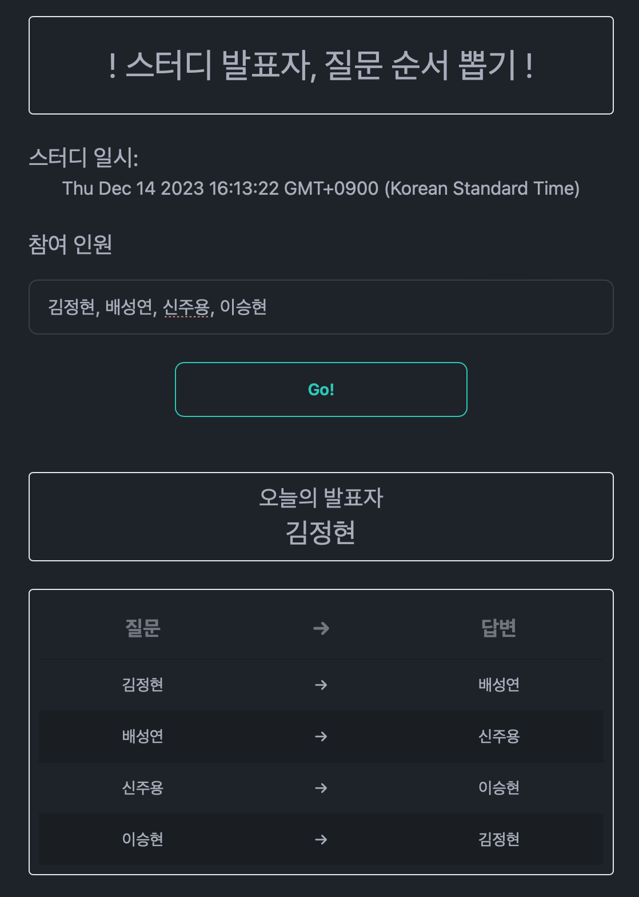

# 2023.12.14. 네트워크, 웹 개요

## 질문 → 답변

- 주용 → 승현: 3-Tier Architecture에 대해 설명해주세요.
    - 키워드: `Web`, `Tier`, `Architecture`
    - 참고 자료:
        - <https://www.ibm.com/topics/three-tier-architecture>
- 정현 → 성연: Segment를 인터넷 환경에서 전송 가능한 형태로 변형한 데이터 유닛은 무엇인가요?
    - 키워드: `OSI 7 Layer`, `PDU`, `Network`
- 승현 → 정현: 웹의 발전 과정에서 1세대, 2세대, 3세대 각각의 특징을 말해주세요.
    - 키워드: `Web`, `History`, `Difference`
    - 참고 자료:
        - [웹 서비스의 역사와 발전 | 1세대, 2세대, 3세대 웹](https://velog.io/@haleyjun/%EC%9B%B9-%EC%84%9C%EB%B9%84%EC%8A%A4%EC%9D%98-%EC%97%AD%EC%82%AC%EC%99%80-%EB%B0%9C%EC%A0%84-%EA%B0%84%EB%8B%A8%ED%9E%88)
        - [HTTP (1) - version 별 특징 (0.9 / 1.0 / 2.0 / 3.0)](https://velog.io/@neity16/HTTP-HTTP-%EB%B2%84%EC%A0%84-%EB%B3%84-%ED%8A%B9%EC%A7%95)
- 성연 → 주용: 두 가지 네트워크 계층 구조 모델의 공통점과 차이점을 설명해주세요.
    - 키워드: `Network`, `Model`, `Layer`

## 개인별 공부 내용 정리

- [Be-HinD](./Be-HinD/README.md)
- [cheesecat47](./cheesecat47/README.md)
- [hyun812](./hyun812/README.md)

## 추가 참고 자료

- <https://infinitecode.tistory.com/25>
- <https://infinitecode.tistory.com/26>
- <https://infinitecode.tistory.com/27>
- <https://infinitecode.tistory.com/28>
- [Stateful vs stateless](https://www.redhat.com/en/topics/cloud-native-apps/stateful-vs-stateless)
- [공인 IP와 사설 IP… 다양한 IP 유형의 차이는? | NordVPN](https://nordvpn.com/ko/blog/public-ip-and-private-ip/)
- [🌐 NAT(Network Address Translation) 이란 무엇인가?](https://inpa.tistory.com/entry/WEB-%F0%9F%8C%90-NAT-%EB%9E%80-%EB%AC%B4%EC%97%87%EC%9D%B8%EA%B0%80)
