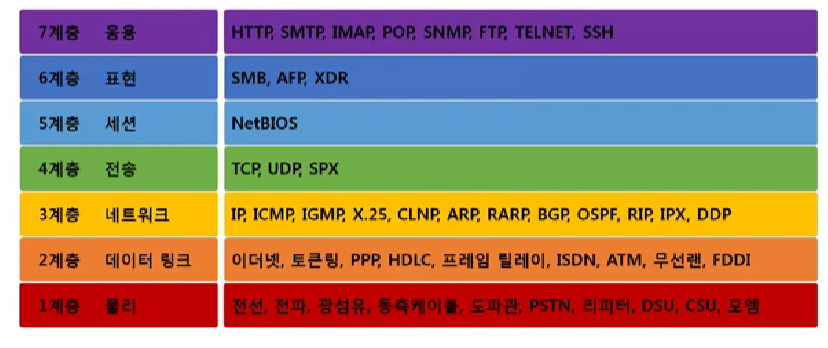
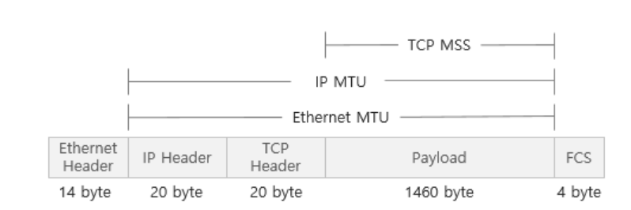

# 네트워크 모델

### 네트워크 프로토콜

**프로토콜이란?**

- 서로 다른 시스템에 있는 개체 간에 성공적으로 데이터를 전송하는 `통신 규약`
- `네트워크`에 연결된 `컴퓨터들`끼리 `데이터`를 `주고받을 수` 있도록 미리 약속한 전송 `규약 및 규칙`
- 네트워크에서 노드와 노드가 통신할 때 어떤 노드가 어떤 노드에게 어떤 데이터를 어떻게 보낼는지 작성하기 위한 양식

 

**네트워크 계층 모델**

**OSI 7계층**

계층적 네트워크 모델 / 계층 간 역할 정의

**패킷이란?**

- `네트워크 상`에서 `전달`되는 `데이터`를 통칭하는 말
- 패킷은 `제어정보(헤더)`와 `사용자정보(페이로드)`로 이루어져 있음
- 여러가지 `프로토콜의 조합`
- 캡슐화를 통해 겹겹이 포장

 

**Encapsulation (캡슐화)**

데이터를 `상위계층에서 하위계층으로` 내려보내면서 `프로토콜`을 `붙이는 과정`

내가 누군가에게 패킷을 `보낼 때` 사용

헤더를 붙이는 작업

 

**Decapsulation** (**역캡슐화, 디캡슐화)**

패킷을 `받았을 때` 프로토콜들을 하나씩 확인하면서 데이터를 확인하는 과정

헤더를 제거하는 작업

 

**PDU ( Protocol Data Unit )**

각각의 계층에서 패킷들의 이름이 다름 이렇듯 계층별 패킷의 이름을 PDU라고 함

- 4계층 세그먼트 (TCP)
- 3계층 패킷 (IP)
- 2계층 프레임 (이더넷)

 

# MAC, IP, PORT

### MAC주소

- **NIC ( 네트워크 인터페이스 카드) 에 대한 식별자**
- 유선/무선 랜카드 식별
- **하드웨어 주소지만 변경 가능**

### IP주소

- HOST에 대한 식별자 ( HOST는 인터넷에 연결된 컴퓨터 )
- 한 컴퓨터에 **여러개**의 IP주소가 있을 수 있음
- **NIC 하나에 여러 개의 주소를 바인딩할 수 있음**

### Port 번호

SW 개발 및 관리 → **프로세스 식별자**

네트워크 관리 ( 4계층 관련 업무 ) → **서비스 식별자**

물리적으로 네트워크를 설치하는 통신공사 → **인터페이스 번호**

**⇒ 식별의 대상이 달라질 수 있음**

 

## 데이터 단위 정리

### Stream

USER모드, Application, Process, Socket 수준에서 사용

끝을 알 수 없는, 시작과 끝이 명확하지 않은 일렬로 쭉 늘어진 데이터 단위

 

**Segmentation (세그멘테이션)**

Stream데이터를 네트워크로 전송하기 전 일정한 크기로 자르는 과정

 

### Segment

전송계층에서 수친 측과 송신 측 사이 데이터를 분할하는 단위

 

**MSS (Maximim Segment Size)**

- TCP상에서 전송할 수 있는 사용자 데이터의 최대 크기
- MTU의 값에 의해 결정
- MSS = MTU - IP Header의 크기 - TCP Header의 크기

 

### Packet

- IP계층 에서 사용하는 데이터 단위
- Segment를 인터넷 환경에서 전송가능한 형태로 캡슐화 한 것
- 네트워크 계층에서 수신 측과 송신 측 사이 데이터를 전송하는 단위

 

**MTU (Maximim Transfer Unit)**

최대 전송 단위

일반적으로 1500바이트

 

### Frame

- 데이터링크 계층에서 사용하는 데이터 단위
- 물리적인 네트워크 매체에서 전송되는 데이터 단위
- Packet를 실어나를 때 또 다시 캡슐화하면 Frame이 됨

# 웹 서비스

## 탄생배경

**티모시 버너스 리**

- 웹 창시자
- 문자데이터가 `text파일`로만 이루어져 있을 당시 논문을 편하게 검색하고 작성하기 위하여 `링크의 필요성`을 느낌
- 단순 `Text` + `Link` 형식을 통해 `HTML` 고안
- `인터넷`을 활용 및 연결 해서 `HTTP` 고안
- `거미줄`의 형태로 문서가 연결되어 있는 것을 `Web Service`라고 지칭

- **HTML**
  **Hyper Text Mark up Language**
  웹 페이지와 그 내용을 구조화 하기 위해 사용하는 마크업 언어
- **HTTP**
  **HyperText Transfer Protocol**
  하이퍼텍스트 링크를 사용하여 웹 페이지를 로드하는데 사용
  네트워크 장치 간에 정보를 전송하도록 설계된 애플리케이션 계층 프로토콜

 

**문서를 다루는 모든 S/W의 구성 요소**

- **Interface (GUI)**
- **제어 체계 (Logic)**
- **Data (문서)**

 

### 초창기 웹 서비스 ( HTTP 1.1 )

> 이 당시 브라우저란 `원격지 문서뷰어`의 역할 , TCP/IP가 전제

**리소스를 가져와 다음을 진행**

1. 구문 분석 ( 비선형 자료구조 / DOM )
2. 렌더링

→ `정적`인 문서를 주고 받는 `단방향` 구조였음

→ 웹 서비스가 복잡해지고 발전함에 따라 `상호 작용`을 `필요`로 하게 됐음 ex) 로그인

→ HTTP 통신의 특징인 `stateless`로 인해 상태 전이의 기억이 필요해졌음 ( 데이터베이스 )

→ 운영간에 `동적`으로 생성된 문서가 response로 날라감 ex) 로그인 성공 및 실패

→ 처리해야 할 `연산`이 생기게 됐음

 

### 정적인 HTML에서 동적인 HTML로

**웹이 복잡하고 거대해지면서 역할을 분리하게 됨**

1. HTML 정보를 읽어 들이는 파싱(자료구조)
2. 화면에 보이는 화면을 표현하는 CSS
3. 연산을 수행하고 동적인 결과를 내는 `JavaScript` ( Mocha → Live → JavaScript )
4. 클라이언트에서 기록 역할을 하는 Cookie

<aside>
💡 JavaScript는 브라우저에서 실행
</aside>

 

- **웹의 발전 1세대, 2세대, 3세대 각각 특징**

  ## 1세대 웹

  **1세대 웹 서비스의 특징 : `전통적인 웹 시스템` `정적`**

  - 1세대 웹은 브라우저를 통해 웹 서버로부터 HTML 파일을 받아오는 형식이었다.
  - 초창기 웹 사이트는 단순히 정보 제공 위주였기 때문에 `user interaction`이 많이 요구되지 않았다.
  - HTML, CSS를 주로 사용했다.

   

  ## 2세대 웹

  **2세대 웹 서비스의 특징 : `user interaction` `동적`**

  - 2세대 웹은 웹서버로부터 `html` 파일을 받는것에 더해서 `javascript`를 통해 필요한 정보를 주고받는다.
  - 웹서비스가 발전함에 따라 `user interaction`이 요구되기 시작했다.이런 요구에 따라 웹브라우저에서 작동하는 언어인`자바스크립트`가 출현했다.그러나 아직은 `javascript`와 `API`가 범용적으로 사용되지는 않았다.

   

  ## 3세대 웹

  **3세대 웹 서비스의 특징 : `프론트엔드/백엔드 구분`**

  - 동적인 기능이 주가 되며 3세대 웹이 된다.
  - `SPA : Single Page Application` : 단일의 html 페이지에서 전체 웹 사이트/서비스를 구현한다.
    이전에는 페이지 구성에 필요한 요소를 매번 전송했다면 3세대 웹에서는 서버에 필요한 파일을 한번에 다운받고, 그 뒤로는 실시간 데이터만 주고받는다.
  - 이에 따라 HTML/JavaScript를 개발하는 Frontend와 데이터를 개발하는 Backend가 명확히 나뉘게 된다.
  - **Frontend 와 Backend가 구조적으로 분리 ->Frontend 서버와 Backend API 서버도 분리 ->그에 따라 Frontend 개발과 Backend 개발 업무가 분리가 되는 구조로 발전헌다.**
