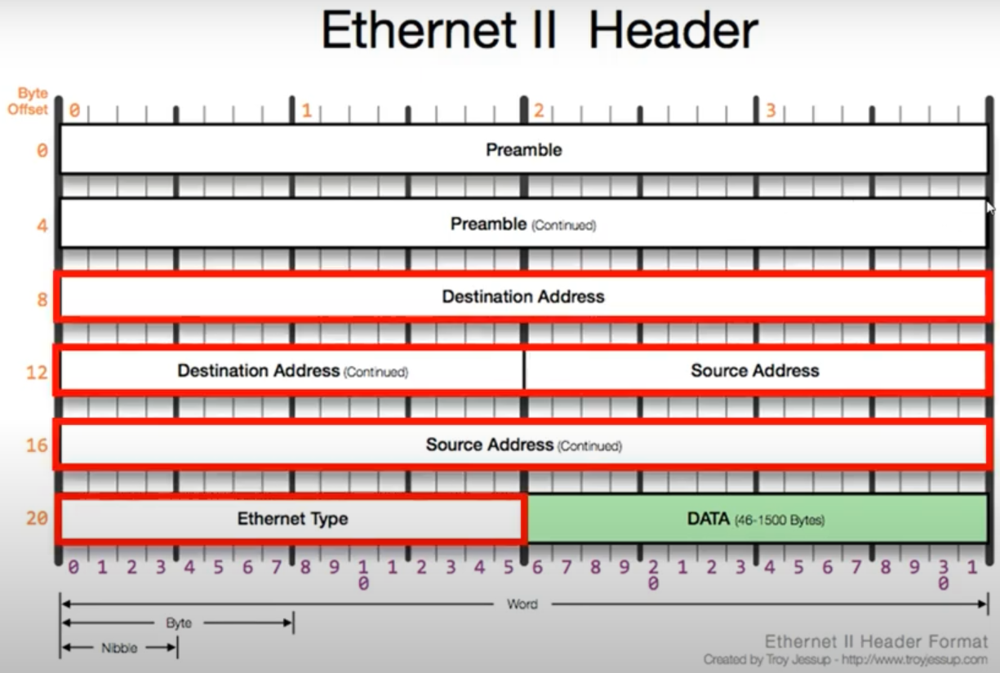
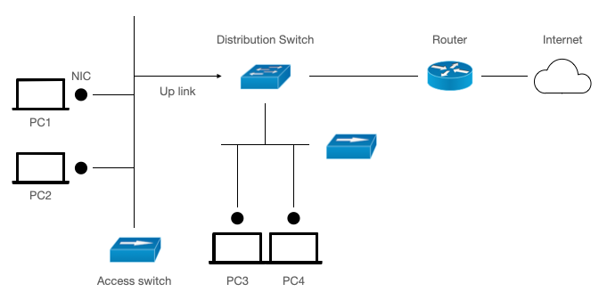
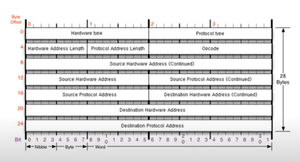
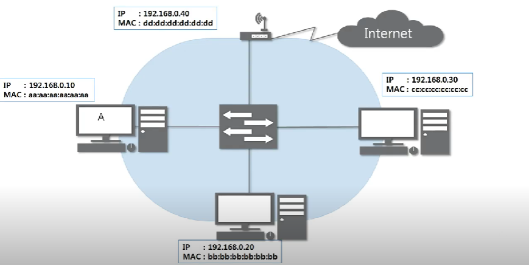

# Data Link Layer (2계층)

### 2계층의 기능

- `하나의 네트워크 대역` 즉, `같은 네트워크 상`에 존재하는 여러 장비들 중 어떤 장비가 어떤 장비에게 보내는 데이터를 전달
- `LAN`에서만 통신할 때 사용
- 다른 네트워크와 통신 하기 위해서는 3계층이 개입 되어야 함
- `오류 제어`, `흐름제어` 수행

 

### MAC주소 ( 물리적인 주소 )

- 하드웨어 장치에 직접적으로 부여되는 주소
- 2계층에서 사용하는 주소
- 12개의 16진수로 이루어짐
- 구분
  - OUI (앞의 3바이트) : IEEE에서 부여하는 일종의 제조회사 식별ID
  - 고유번호 (뒤의 3바이트) : 제조사에서 부여한 고유번호

 

### Ethernet 프로토콜

 

**Destination Address ( 6바이트 )**

- 목적지 MAC 주소

**Source Address ( 6바이트 )**

- 출발지 MAC 주소

**Ethernet Type ( 2바이트 )**

- 3계층 프로토콜을 미리 알려주는 역할
- DATA (페이로드) 의 타입
- IPv4 ( 0x0800) , ARP( 0x0806)

**DATA ( 페이로드 )**

 

### L2 Switch

**2계층 장비로 패킷의 MAC주소를 읽어 스위칭함**

 

### 종류

- **L2 Access**

  - **Endpoint(pc)와 직접적으로 맞닿은 스위치 Ex) 방 하나**

- **L2 Distribution**
  - **스위치를 위한 스위치 Ex) 한 층**
  - 더 상위 계층과 연결하기 위해서는 Router와 연결
  - Router은 L3장치로 게이트웨이 역할을 함 Ex) 건물

 

### 용어 정리

- **Endpoint**
  - 네트워크를 이용하는 이용 주체 Ex) pc, 스마트폰 등
- **Uplink**
  - 상위 계층 스위치로 연결되는 라인 (케이블)
  - 상향연결
  - Link-up : 연결
  - Link-down : 연결 X

 

# ARP 프로토콜

### ARP ( Address Resolution Protocol )

네트워크 상에서 `IP주소`를 물리적 네트워크 주소(`MAC주소`)로 `대응` 시키기 위해 사용되는 `프로토콜`

 

### RARP ( Reverse Address Resolution Protocol )

반대로 물리적 네트워크 주소(`MAC주소`)로 `IP주소`를 알아내는 `프로토콜`

 

### ARP 프로토콜의 구조

 

**Hardware type**

- 2계층에서 사용하는 Protocol의 타입
- 0x0001 - 이더넷

**Protocol type**

- Protocol Address 의 타입
- 0x0800 - IPv4

**Hardware Address Length**

- MAC 주소의 길이
- 0x06 (6바이트)

**Protocol Address Length**

- IPv4 주소의 길이
- 0x04 (4바이트)

**Opcode**

- Operation Code
- 요청하고 있는지 요청에 대한 응답을 하고 있는지를 나타냄
- 0x0001 - 요청
- 0x0002 - 응답

**Source Hardware Address ( Continued )**

- 6 바이트
- 출발지 MAC 주소

**Source Protocol Address ( Continued )**

- 4 바이트
- 출발지 IPv4 주소

**Destination Hardware Address ( Continued )**

- 6 바이트
- 목적지 MAC 주소

**Destination Protocol Address ( Continued )**

- 4 바이트
- 목적지 IPv4 주소

 

### 통신 과정

 

1. A가 IP주소를 통해 MAC주소를 알기 위하여 스위치에게 ARP요청을 보냄
   - 3계층 ARP 프로토콜에서 Destination Hardware Address를 모르기 때문에 00 00 00 00 00 00 으로 보냄
   - 2계층 Ethernet 프로토콜에서 Destination Address를 모르기 때문에 FF FF FF FF FF FF 으로 보냄 ( Broadcast주소가 되므로 같은 네트워크 대역의 모든 호스트에게 전송하게 됨)
2. 스위치는 해당 요청을 같은 네트워크 대역 내 모든 호스트에게 전송
   - 스위치는 2계층 장비이므로 2계층 프로토콜인 Ethernet 까지만 decapsulation
   - 이후 모든 호스트에게 전송
3. 각 호스트가 스위치로부터 받은 패킷을 확인
   - 각 호스트들은 3계층 ARP 프로토콜 까지 확인
   - 본인의 IP주소와 목적지 IP주소가 일치하지 않으면 패킷을 버림
   - 일치하면 ARP응답 프로토콜을 만듬 ( 출발지 MAC주소를 해당 호스트의 MAC주소로 )
4. 요청을 보냈던 호스트가 이를 확인하고 ARP 캐시 테이블에 등록
   - 통신을 하기 위하여 위 과정을 최초 한번은 진행하게 됨

 

### ARP 테이블

- 통신했던 컴퓨터들의 IP주소와 MAC주소를 매핑 해놓은 테이블
- 수동 등록을 하지 않는다면 일정시간이 지나면 사라짐
