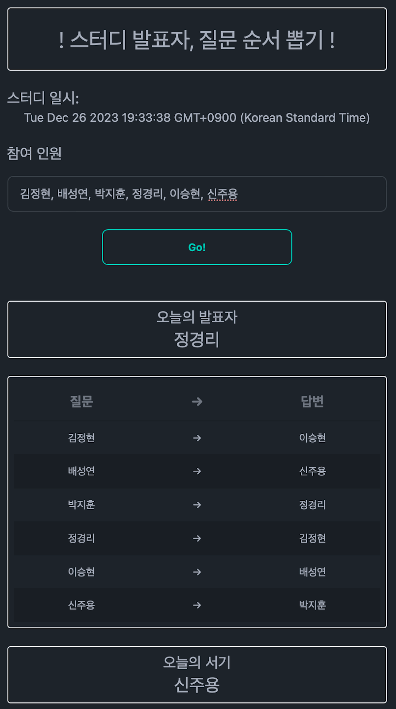

# 2023.12.26. 인터넷 계층

## 질문 → 답변

- 정현 → 승현: OSI 3계층이 어떤 역할을 하는 계층인지 설명해 주세요.
    - 키워드: `OSI 3계층`, `프로토콜`, `통신`
- 성연 → 주용: 패킷 헤더 구조에서 checksum의 역할은 무엇인가요?
    - 키워드: `structure`, `function`, `checksum`
- 지훈 → 경리: 조각화에서 id, flag, offset 각각의 역할이 무엇인가요?
    - 키워드: `조각화`, `id`, `flag`, `offset`
- 경리 → 정현: 라우터의 동작을 라우팅 테이블을 사용해 설명해 주세요.
    - 키워드: `라우팅 테이블`
- 승현 → 성연: IPv6가 등장하게 된 배경과 IPv4와의 차이에 대해 설명해 주세요.
    - 키워드: `IPv4`, `IPv6`
    - 참고 자료:
        - <https://www.guru99.com/ko/difference-ipv4-vs-ipv6.html>
- 주용 → 지훈: Subnet이란 무엇인가요? Subnet Mask를 사용하는 왜 사용하나요?
    - 키워드: `Subnet`, `reason`, `Subnet Mask`
    - 참고 자료:
        - <https://www.cloudflare.com/ko-kr/learning/network-layer/what-is-a-subnet/>

### 추가 질문

1. (TTL 관련) 네트워크에서 사이클이 발생하는 경우? 이유?
2. ARP 프로토콜은 필수인가?
3. 조각화 전 상위 패킷의 헤더는 조각화 후 한 조각에만 붙는가?

## 개인별 공부 내용 정리

- [bae2019](./bae2019/README.md)
- [Be-HinD](./Be-HinD/README.md)
- [cheesecat47](./cheesecat47/README.md)
- [hyun812](./hyun812/README.md)

## 추가 참고 자료

- 
