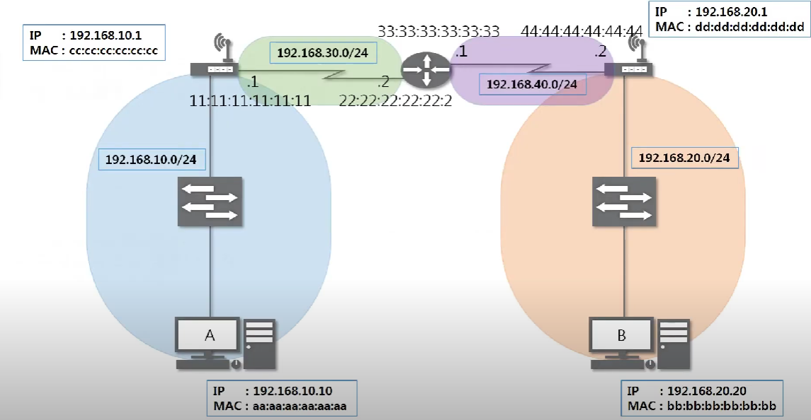
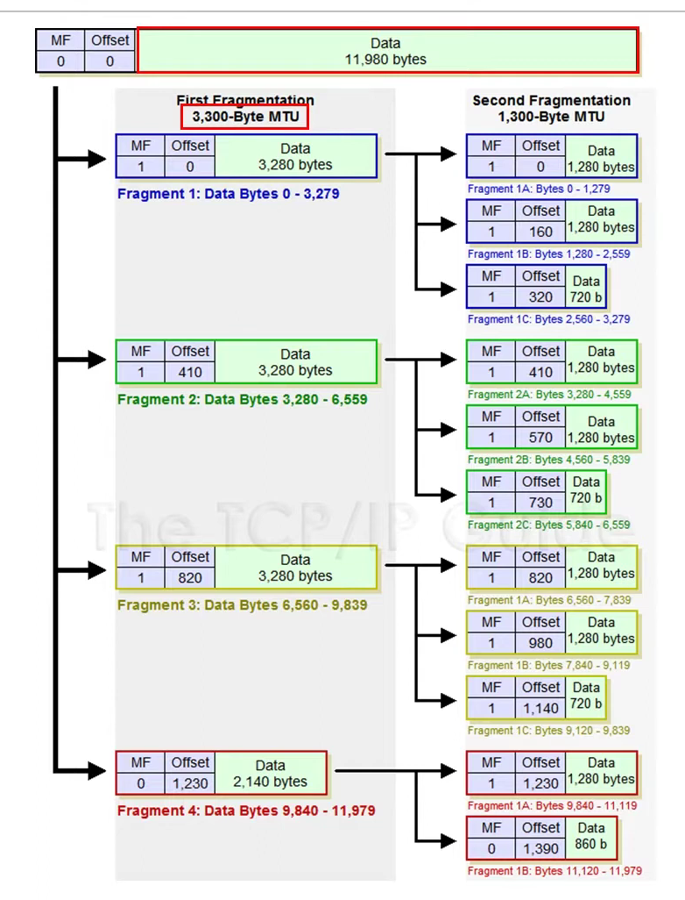
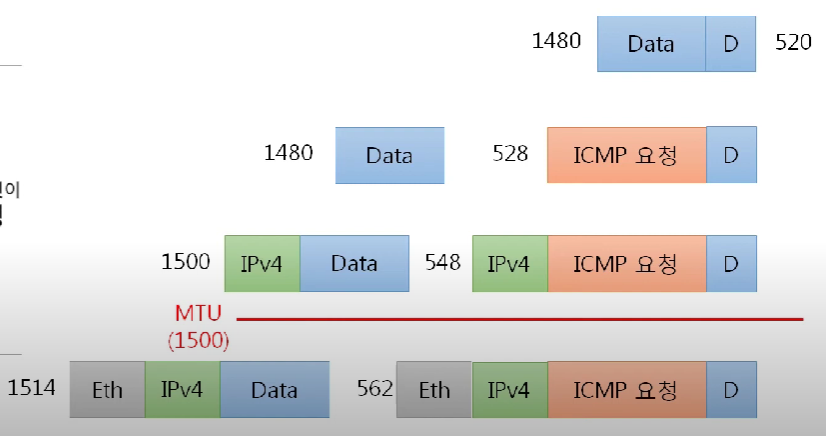

# 인터넷 계층

## IPv4 프로토콜

- 네트워크 상에서 데이터를 교환하기 위한 프로토콜
- 데이터가 정확하게 전달될 것을 보장하지 않음
  - 데이터의 정확하고 순차적인 전달은 그보다 상위 프로토콜인 `TCP에서 보장` (4계층)
- 중복된 패킷을 전달하거나 패킷의 순서를 잘못 전달할 가능성도 있음 (악의적으로 이용되면 DoS 공격)

<br>

### IPv4프로토콜 구조


20바이트 + 옵션이 붙을때마다 4바이트씩 추가 해서 총 60바이트 까지 가능

**Version** - 일반적으로 4가옴

**IHL (Header Length)** - 4bit

- 이진수 4개로 표현할 수 있는 최대가 15이기 때문에 나누기 4를 해서 작성
- 일반적으로 5가옴

**Type of Service (TOS)** - 지금은 사용하지 않고 0으로 비워져 있음

**Total Length**

- 페이로드까지 합친 전체의 길이
- 상위계층부터 인캡슐레이션되어 내려온 데이터 길이 전부 합침

**데이터를 보낼 때 최대전송단위로 인해 잘라서 보내게 되는데 이때 쪼개진 애들을 알아 볼 수 있게 하는 값**

1. **Identification** - 쪼개진 애들이 원래는 한 개였다는 것을 표시하기 위한 id값
2. **IP Flags** - 3비트로 이루어져있음
   - 첫번째는 사용하지 않음
   - 두번째 D는 보내는사람이 데이터를 안쪼갠다는 것을 의미, 잘 사용하지 않음
   - **세번째 M은 최대 전송단위 보다 큰 데이터일때 조각화가 이루어지고 상대방에게 패킷이 더 있으니 기다려야 한다는 것을 의미**
3. **Fragment Offset**

- 13비트로 원래대로 복구할 때의 순서를 위해 사용
- 맨앞에서부터 얼마만큼 떨어져있는지를 나타냄, 8로 나눠서 사용

**Time To Live (TTL)**

- 패킷이 살아있을 수 있는 시간
- 계층 장비를 거칠때마다 1씩줄어드는데 0이되면 사라짐
- 윈도우 128, 리눅스 64로 설정

**Protocol** - 상위 프로토콜의 타입을 알려줌, ICMP - 1 TCP-06, UDP- 11

**Header Checksum**

- 이 헤더에 오류가 있는지를 확인
- 받는쪽에서는 세팅된 값들을 다시 계산에서 Header checksum의 값과 비교

**Source Address** - 출발지 IP주소

**Destination Address** - 목적지 IP주소

<br>

## ICMP 프로토콜

**특정 대상과 내가 통신이 잘되는지 통신 문제를 진단하는데 사용하는 프로토콜**

<br>

### 구조


<br>

**Type**

0 (Echo Reply) - 응답

8 (Echo) - 요청

3 (Destination Unreachable) - 목적지에 도달할 수 없음, 경로상의 문제

11 (Time Exceded) - 요청 시간 만료, 목적지까지는 갔지만 응답을 못 받음, 상대방의 문제 ex) 방화벽

5 (Redirect) - 원격지에 있는 상대방의 라우팅 테이블을 ICMP로 수정하기 위함

**Code**

**Checksum**

**Other message specific information…**

<br>

## 라우팅 테이블

- 어디로 보내야 하는지 설정되어 있는 라우팅 테이블
- 적혀있지 않으면 찾아갈 수 없음
- 다른 네트워크 대역을 찾아가는 지도

<br>

### 통신과정



네트워크 대역이 4개로 나누어져 있음

1. A컴퓨터와 공유기1
2. 공유기1과 라우터
3. 라우터와 공유기2
4. 공유기2와 B컴퓨터

<br>

**A와 B가 통신하는 과정**

1. A의 라우팅 테이블을 확인

   B의 네트워크 대역이 있어야 통신을 할 수 있음

<br/>
    
2. 프로토콜을 작성
    
    **ICMP 요청 프로토콜 작성 ( Type 8로 요청 )**
    
    IPv4 프로토콜 작성
    
    Ethernet 프로토콜의 목적지 MAC주소는 게이트웨이의 MAC주소로 설정
    
    가까운 곳에서만 통신을 하는 프로토콜이므로
    
    MAC주소를 모른다면 ARP프로토콜
    
<br/>

3. 공유기에서 이를 확인 ( 다른 네트워크 대역으로 넘어갈 때 )

   목적지 IP주소가 자신과 다름

   다시 라우팅 테이블을 확인

   이후 Ethernet 프로토콜을 다시 작성 ( 목적지 MAC주소와 출발지 MAC주소를 변경 )

<br/>

4. **Ethernet 프로토콜은 네트워크 대역이 바뀔때마다 다시 작성** (순서 3번 반복)

<br/>

5. 이후 B가 받게 됨

   **ICMP 요청 프로토콜 작성 ( Type 0로 응답 )**

<br>

### IPv4의 조각화

- 큰 IP 패킷들이 적은 `MTU(Maximum Transmission Unit)`를 갖는 링크를 통하여 전송되려면 여러개의 작은 패킷으로 쪼개어/조각화 되어 전송되어야 함
- **즉 목적지까지 패킷을 전달하는 과정에 통과하는 각 라우터마다 전송에 적합한 프레임으로 변환이 필요**
- **일단 조각화되면, 최종 목적지에 도달할 때까지 재조립되지 않는 것이 일반적**
- IPv4에서는 발신지 뿐만 아니라 중간 라우터에서도 IP조각화가 가능
- IPv6에서는 IP 단편화가 발신지에서만 가능
- **재조립은 항상 최종 수신지에서만 가능**

<br>



<br>

IPv4의 헤더크기(20바이트)를 뺀만큼(3280) 쪼갬

각 Data는 페이로드, 그 앞에는 IPv4 프로토콜

4개의 ID값은 같게됨 MF, Offset를 활용하여 최종적으로 합치게 됨

<br>

### 조각화 과정

MTU가 1500이고 순수한 데이터가 2000바이트 일때 조각화하는 과정

<br>



- IPv4가 붙고 MTU가 거르고 Ethernet가 붙음
- ICMP는 마지막애한테만 붙음

<br>

### IP 주소(Internet Protocol)

Host에 대한 식별자

**종류**

- IPv4 : 주소 길이가 32bit

- IPv6 - 주소 길이가 128bit

<br>

### IPv4

네트워크 주소와 호스트주소로 나뉨

**네트워크 주소**

- 호스트들을 모은 네트워크를 지칭하는 주소
- 네트워크 주소가 동일한 네트워크를 로컬 네트워크라고 함

**호스트 주소**

- 하나의 네트워크 내에 존재하는 호스트를 구분하기 위한 주소

이를 나뉘는 경계점이 고정되어 있지 않기에 `Subnet-mask`를 사용

<br>

**Subnet-mask**

Network ID의 길이가 얼마인지를 나타내는 것

IP주소와 서브넷마스크를 비트 AND 연산 진행한 것이 Network ID가 됨

```
IP 주소 : 192.168.60.14
서브넷 마스크 : 255.255.255.0

1100 0000 (192)
1111 1111 (255)

		↓   bit AND 연산 진행

1100 0000 결과 : 192

...

0000 1110 (14)
0000 0000 (0)

		↓   bit AND 연산 진행

0000 0000 결과 : 0
```

⇒ 192.168.0.0

192.168.60.14/24 - CIDR(Classless Inter-Domain Routing)
