# 블로그 정리 포스팅 업로드
https://infinitecode.tistory.com/42

https://infinitecode.tistory.com/43

# UDP 프로토콜

안전한 연결을 지향하지 않음.

사용자 데이터그램 프로토콜(User Datagram Protocol, UDP)은 유니버셜 데이터그램 프로토콜이라고 일컫기도 함.

UDP의 전송 방식은 너무 단순해서 서비스의 신뢰성이 낮고, 데이터그램 도착 순서가 바뀌거나, 중복되거나, 심지어는 통보 없이 누락시키기도 함.

UDP는 일반적으로 오류의 검사와 수정이 필요 없는 프로그램에 수행할 으로 가정.

# UDP 프로토콜의 구조

Length : UDP 프로토콜 헤더 및 페이로드 길이 포함 총 길이.

Checksum : 프로토콜이 잘못된 게 있나 확인하는 값.

# UDP 프로토콜을 사용하는 프로그램

DNS 서버

- 도메인을 물으면 IP를 알려주는 서버.

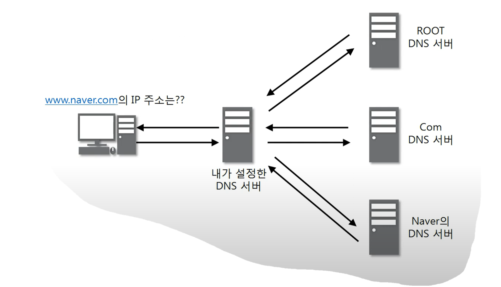

tftp 서버

- UDP로 파일을 공유하는 서버.

RIP 프로토콜

- 라우팅 정보를 공유하는 프로토콜

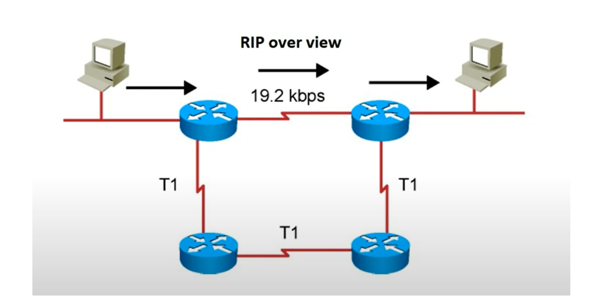

---

# TCP 프로토콜

전송 제어 프로토콜(Transmission Control Protocol, TCP)은 인터넷에 연결된 컴퓨터에서 실행되는 프로그램 간에 통신을 안정적으로, 순서대로, 에러없이 교환할 수 있게 한다.

TCP의 안전성을 필요로 하지 않는 애플리케이션의 경우 일반적으로 TCP 대신 비접속형 사용자 데이터그램 프로토콜(User Datagram Protocol)을 사용한다.

TCP는 UDP보다 안전하지만 느리다.

## TCP 프로토콜의 구조

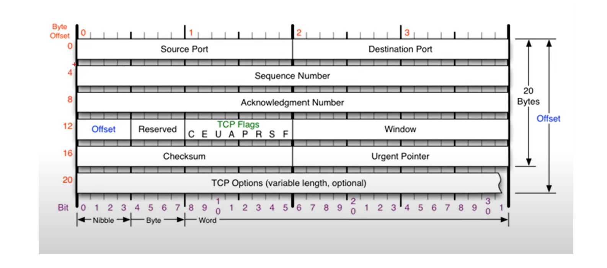

Sequence Number

Ackonwledgment Number

Offset : Header의 길이.

Reserved : 예약된 필드, 사용하지 않음.

Window : 남아있는 TCP Buffer 공간을 알려주는 필드.

Urgent Pointer : TCP Flags 중 U플래그가 설정되어있을 때 어디서부터가 긴급 데이터인지 알려주는 위치 값.

TCP Options (variable length, optional) : TCP 연결 관리 기능을 확장시키는데 주로 사용되는 옵션 필드로 TCP 헤더 내에 포함됨. 그 크키는 가변 (0~40 바이트 즉, 최대 40 바이트까지 옵션을 넣을 수 있음)적

## TCP Flags

위 그림에서 U,A,P,R,S,F만 알아두면 됨.

U (Urgent Flag) : 현재 보내는 데이터가 급한 데이터인지 알려주는 플래그 값. (Urgent Pointer와 연관됨.)

A (Ack Flag) : TCP에서 중요하고 많이 사용되는 플래그. 승인 비트라고 불리고 요청에 관한 응답 플래그 값.

P (Push Flag) : TCP Buffer와 상관없이 데이터를 계속 밀어 넣겠다는 것에 대한 플래그 값.

R (Reset Flag) : 상대방과 연결이 되어있는 상태에서 문제가 발생했을 경우 다시 연결을 하고자 할 때 설정하는 플래그 값.

S (Sync Flag) : 상대방과 연결을 시작할 때 무조건 사용하는 플래그 값.

F (Fin Flag) : 상대방과의 연결을 끊을 때 사용하는 플래그 값.

# 3Way Handshake

TCP를 이용한 통신과정

TCP를 이용한 데이터 통신을 할 때 프로세스와 프로세스를 연결하기 위해 가장먼저 수행되는 과정

1. 클라이언트가 서버에게 요청 패킷을 보내고
2. 서버가 클라이언트의 요청을 받아들이는 패킷을 보내고
3. 클라이언트는 이를 최종적으로 수락하는 패킷을 보냄.

위의 3개의 과정을 3Way Handshake라고 부른다.

클라이언트와 서버 사이에서 TCP Flag값을 수정하며 3Way Handshake 과정을 진행.

추가로 갱신되는 Sequence Number, Ackonwledgment Number값에 대해서는 네트워크 보안에 관심이 있을 경우 계산하는 방법을 알아야 함.(해당 값을 통해서 세션 하이재킹 및 도스 공격이 가능하기 때문에.)

Ackonwledgment Number의 경우 받은 Sequence Number에 대해서 +1한 값을 응답으로 전송.

Sequence Number의 경우에는 받은 Ack Number가 되는데(동기화가 이루어졌을 때) 첫 전송일 경우에는 랜덤한 값으로 지정.

두 가지의 필드값이 동기화를 의미하기 때문에 제 3자가 이 값에 대해 계산을 통해 알 수 있을 경우 서버는 제 3자가 요청한 값에 대해서 정상적으로 데이터를 보내기 때문임.

## 3Way Handshake 이후 통신과정

웹 서버와 연결을 위한 3Way Handshake과정에서는 추가적인 페이로드 없이 단순 TCP 패킷만을 캡슐화해서 통신을 했는데 이후 데이터 전달 과정에서는 페이로드를 포함한 패킷을 주고 받아야 함.

이 과정에서의 일정한 규칙이 존재하는데

1. 보낸 쪽에서 또 보낼 때는 SEQ번호와 ACK번호가 그대로
2. 받는 쪽에서 SEQ번호는 받은 ACK번호가 됨.
3. 받는 쪽에서 ACK번호는 받은 SEQ번호 + 데이터의 크기

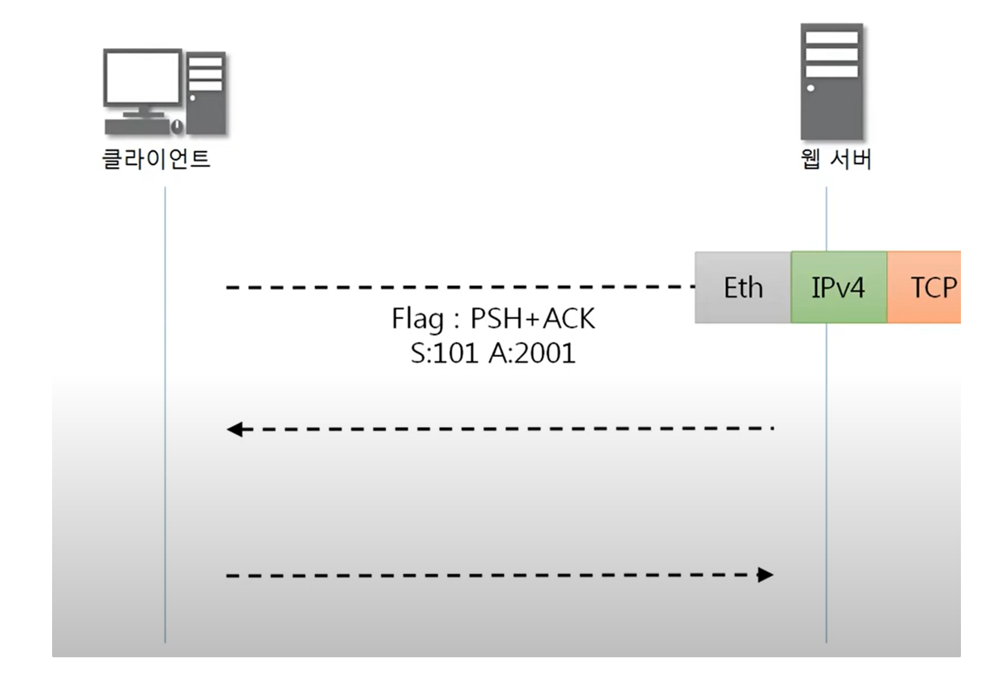

클라이언트에서 데이터가 100BYTE인 요청 패킷을 보낼 때.

보내는 데이터가 존재하므로 Push Flag 세팅

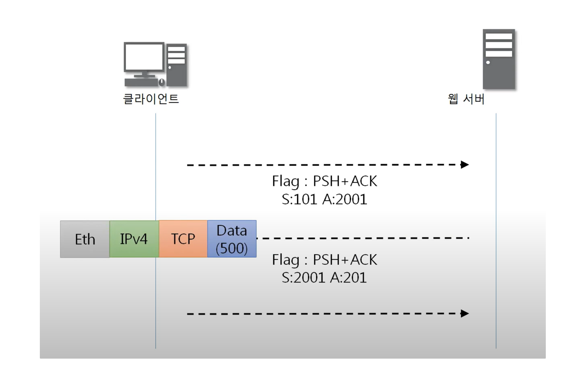

웹 서버에서는 해당 요청에 대해 SEQ번호는 받은 ACK번호를 그대로,

ACK 번호는 받은 SEQ번호 + 데이터 크기(100BYTE)인 201로 세팅해서 500BYTE의 요청에 대한 데이터를 전송

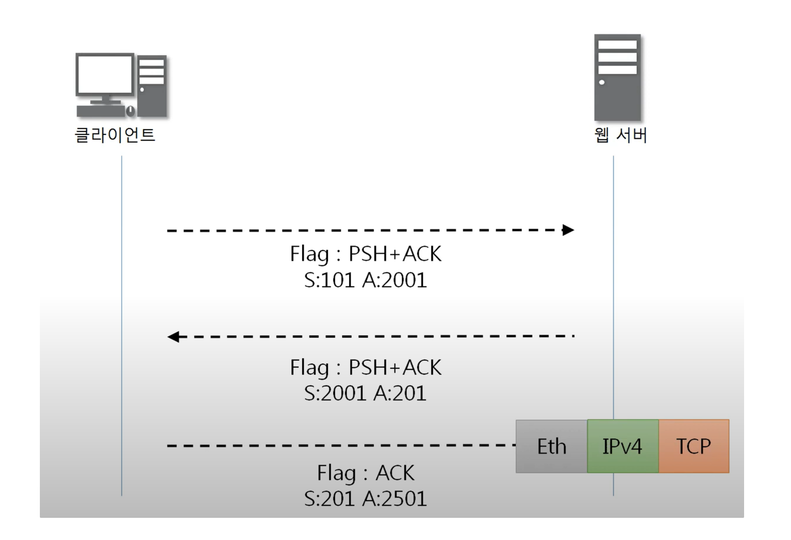

클라이언트는 ACK 요청으로 위 과정과 같은 규칙을 통해 SEQ 및 ACK번호를 지정 후 응답 패킷을 다시금 웹 서버로 전송.

보내는 데이터가 없기 때문에 Push Flag는 사용 안함.

# TCP 상태전이도

TCP의 여러가지 상태 변화를 도식화

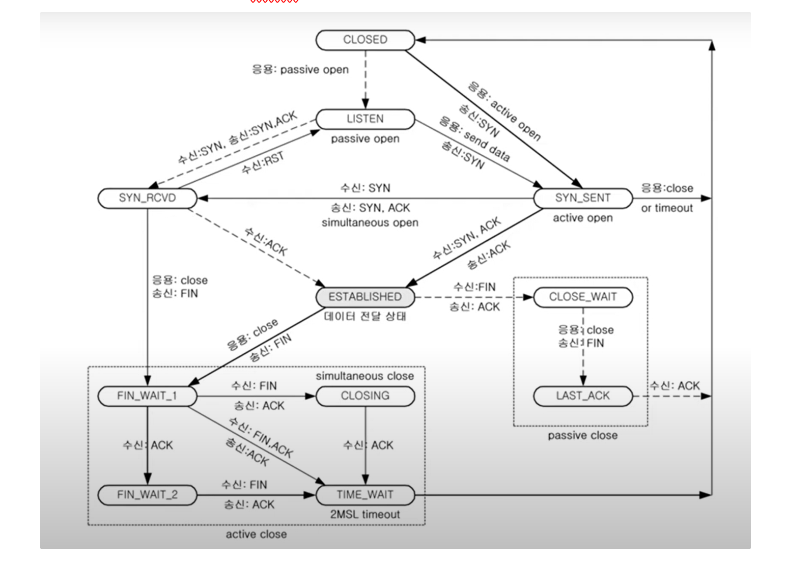

실선 : Client의 상태변화

점선 : Server의 상태변화

LISTEN 상태 : 4계층은 통신을 위해 포트번호를 사용하는데 LISTEN상태는 Server쪽에서 해당 포트를 열어놓은 상태를 뜻함. (수동적)

(Client의 경우 포트를 사용할 때는 active open이라고 함. (능동적) ) 

ESTABLISHED 상태 : Client - Server가 연결되어 있는 상태.

단순히 3Way Handshake에 대한 설명뿐이였음. 유의미한 강의내용은 X

## 널널한 개발자 정리

해당 강의에서는 서버가 클라이언트에게 데이터를 전송하는 과정을 TCP 프로토콜을 사용하여 설명.

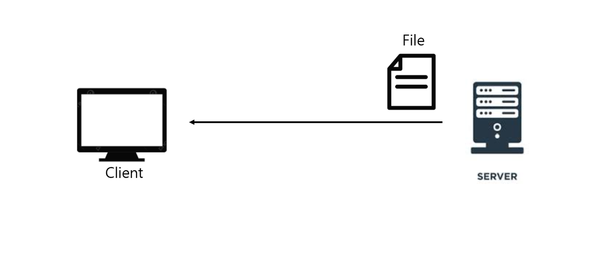

예를들어 서버의 HDD에 저장되어 있는 파일을 클라이언트에게 전송하기 위해서는 File System의 Driver를 통해 해당 파일을 서버 프로세스의 메모리에 올려야 함.

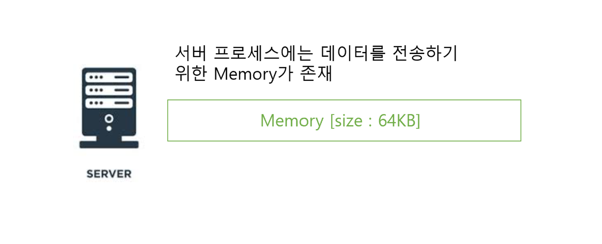

만약 대용량의 데이터를 전송하게 될 때 서버 프로세스의 메모리가 부족한 경우 해당 데이터를 분해해서 메모리에 적재하게 됨. (1.4MB → 64KB씩 분해)

서버 프로세스 메모리에 올려진 데이터의 일부는 Socket을 통해 클라이언트로 전송을 하기위해 TCP단에 있는 또다른 Buffer(메모리)로 카피가 발생

TCP → IP로 내려갈 때 또한 Buffer에 있는 데이터의 분해가 발생하는데 분해된 데이터를 Segment 패킷이라 부름.

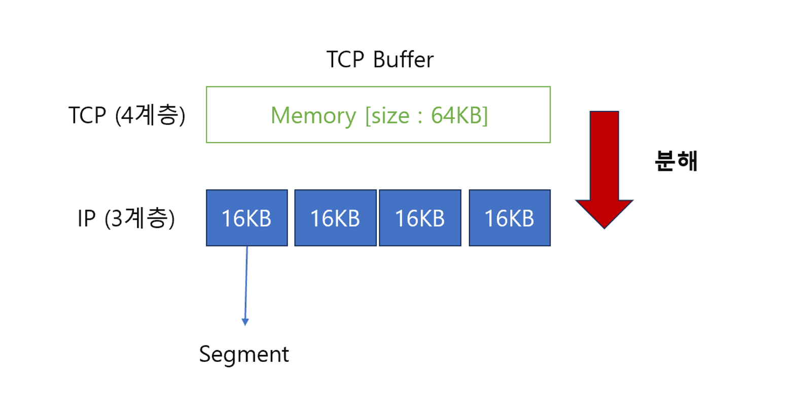

하나하나의 Segment패킷은 재차 L2단(2계층)으로 내려오면서 Frame이라는 패킷으로 다시 캡슐화가 이루어지고 이러한 Frame패킷들이 클라이언트로 보내지게 됨.

이제 Client가 Frame 패킷을 받았다는 가정하에 상황들을 알아보자.

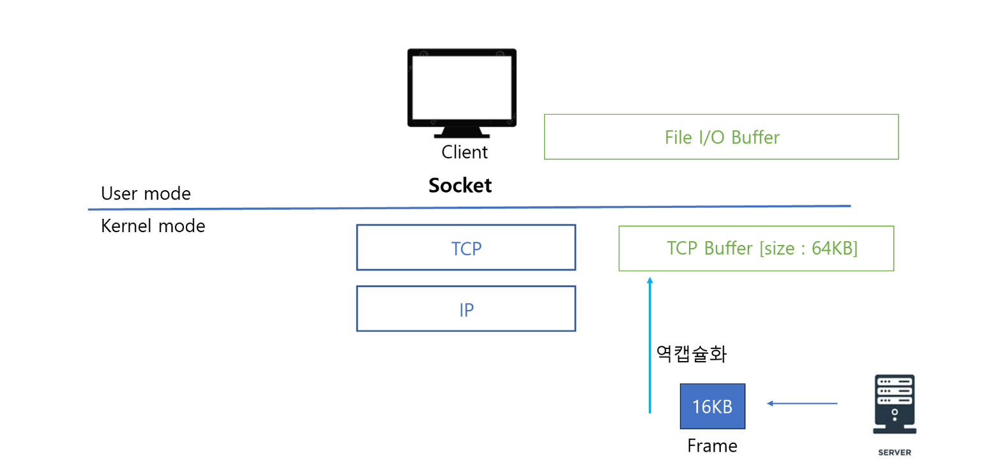

클라이언트 단에서는 받은 Frame을 역캡슐화를 통해 패킷 → Segment로 데이터의 일부분을 꺼내 TCP Buffer에 적재함.

TCP Buffer에 적재한 순간 클라이언트는 서버에게 데이터를 잘 받았다고 알리는 ACK 신호를 전송.

여기서 중요한 점은 Server는 Frame을 계속해서 보내는 것이 아닌 일부분을 보낸 후 클라이언트에게 ACK신호를 받을 때 까지 Wait을 하기 때문에 UDP에 비해 속도지연이 발생함.

또한 클라이언트의 TCP Buffer의 크기가 가득차게 될 경우가 발생하는데

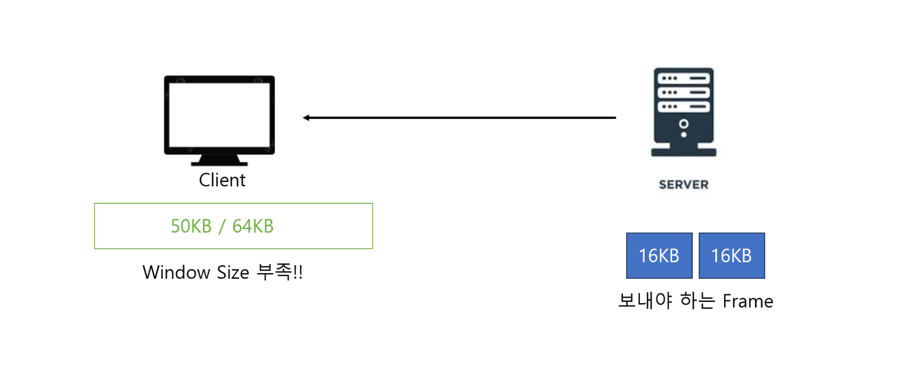

이렇게 될 경우 서버는 데이터를 보내지 않음. >> Wait 발생.

이러한 상황을 해결하기 위해서 중요한 점은 TCP Buffer(Window size)가 부족한 상황이 오지않도록 Socket단에 있는 File I/O Buffer로 계속해서 Read를 해서 비워주어야함.

**즉, Read 속도가 Network 수신속도 보다 빨라야 TCP Buffer가 부족하게 될 경우가 없어짐.**
