# 전송 계층

- UDP 프로토콜 : 비연결지향형
    
    -UDP : User Datagram Protocol
    
    -전송방식 너무 단순 → 신뢰성 $\downarrow$, 데이터그램 전송 오류 $\uparrow$
    
    -오류 검사, 수정 필요 없는 프로그램에서 수행
    
    -구조
    
    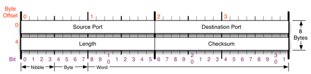
    
    -UDP 프로토콜 사용 프로그램
    
    ㄴDNS 서버 : 도메인 입력 시 IP 반환
    
    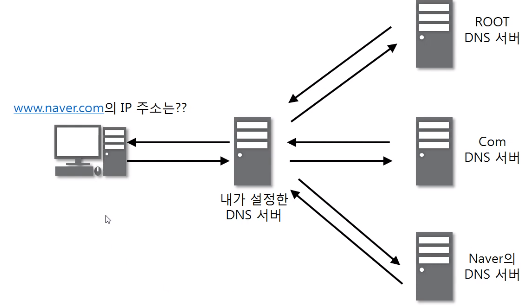
    
    ㄴTFT 서버 : UDP로 파일 공유
    
    ㄴRIP 프로토콜 : 라우팅 정보 공유
    
    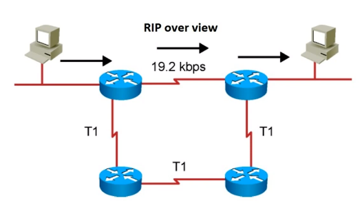
    
- TCP 프로토콜 : 연결지향형
    
    -TCP : Transmission Control Protocol
    
    -프로그램 간 통신을 안정적으로, 순서대로, 에러없이 교환 가능
    
    -UDP보다 안전하지만 느림
    
    - 구조
        
        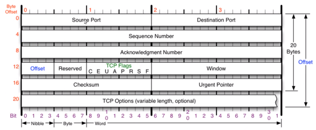
        
        ㄴOffset : 헤더 길이
        
        ㄴWindow : 데이터 수신 가능 잔여 공간(버퍼 가용 공간) 정보
        
        ㄴUrgent Pointer : urgent 데이터일 때 어디서부터가 긴급한 데이터인지
        
        ㄴOptions 추가 가능
        
        ㄴTCP Flags
        
        ㄴU : Urgent bit, 긴급 비트 - 급한 데이터 여부
        
        ㄴA : Ack bit, 승인 비트 - 요청에 대한 응답
        
        ㄴP : Push bit, 밀어넣기 비트 - buffer의 잔여 공간과 관계없이 데이터 밀어넣기
        
        *원래는 TCP 버퍼 상에 데이터 일정 크기 이상 축적 후 전송
        
        ㄴR : Reset bit, 초기화 비트 - 기존의 연결 관계 초기화
        
        ㄴS : Sync bit, 동기화 비트 - 연결 시작 시 사용, 동기화
        
        ㄴF : Fin bit, 종료 비트 - 연결 중단 시 사용
        
    - 3-Way Handshake : TCP 연결 수립 과정
        
        -TCP를 이용한 데이터 통신 시 프로세스 간 연결을 위한 선결 과정
        
        ㄴ클라이언트 →     [요청 패킷]      → 서버
        
        ㄴ클라이언트 ← [요청 응답 패킷] ← 서버
        
        ㄴ클라이언트 →     [수락 패킷]      → 서버
        
        -요청 
        
        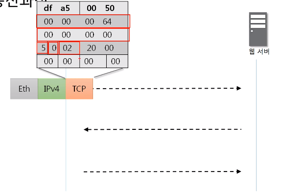
        
        -요청 응답 12(16) = 18 = 1 0010(2) → ack, syn
        
        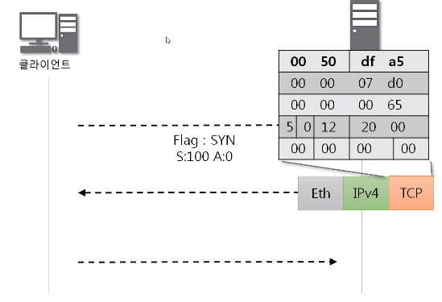
        
        -수락
        
        
        
        -최종
        
        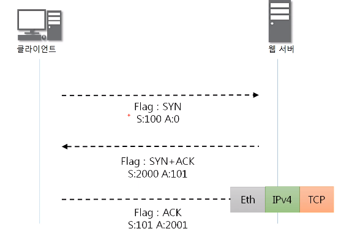
        
        *추가
        
        ㄴACK번호는 Sequence번호 +1
        
        ㄴ처음 sequence번호 : 랜덤
        
        ㄴ동기화 후 sequence번호 : ack번호
        
    - TCP 데이터 송수신 과정
        
        -데이터 송수신 시 규칙
        
        ㄴ보낸 쪽에서 다시 보낼 때 SEQ번호, ACK 번호 그대로
        
        ㄴ받는 쪽의 SEQ번호는 받은 ACK번호
        
        ㄴ받는 쪽의 ACK번호는 받은 SEQ번호 + 데이터 크기
        
        -예시
        
        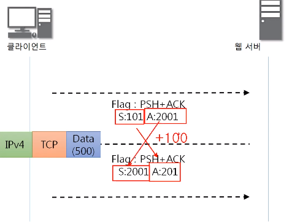
        
        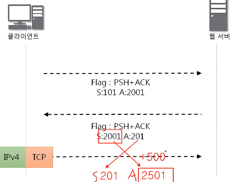
        
    - TCP 상태전이도
        
        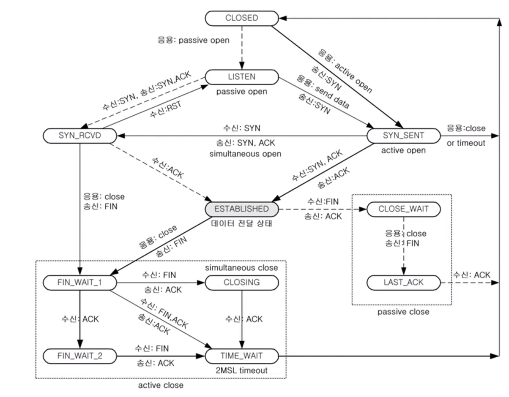
        
        -실선 : client 상태 변화
        
        -점선 : server 상태 변화
        
        -Listen 상태 : port번호를 server에서 사용하고 있는 상태
        
        ㄴ클라이언트 측의 요청을 받고 있는 상태
        
        -Established 상태 : 연결이 수립된 상태
        
        -CLOSED →[active open]→ SYN-SENT(client) →[SYN]→ SYN_RCVD(server) →[ACK]→ ESTABLISHED
        
    - TCP 상태전이도 with 3Way Handshake
        
        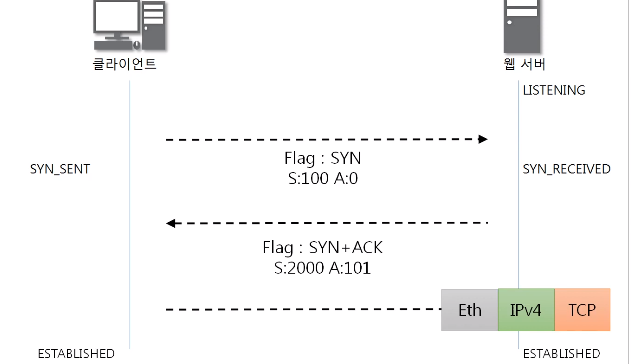
