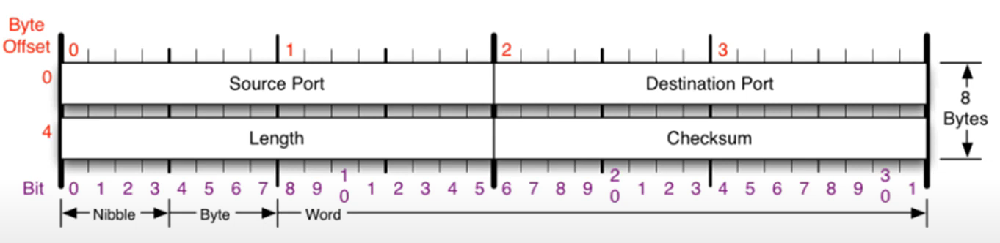
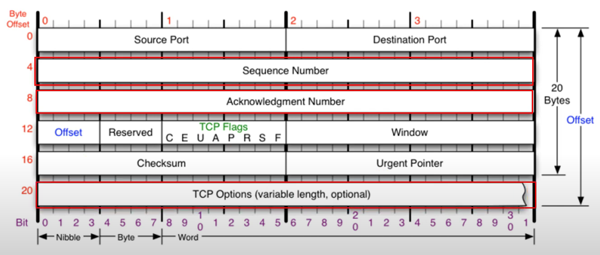
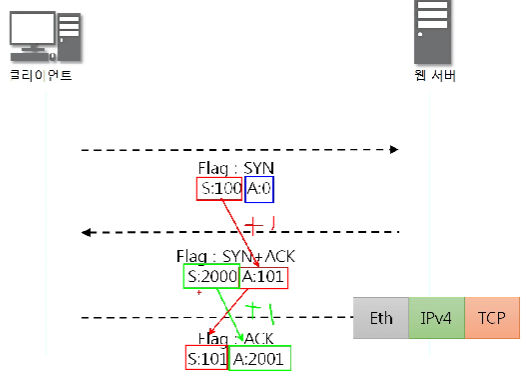
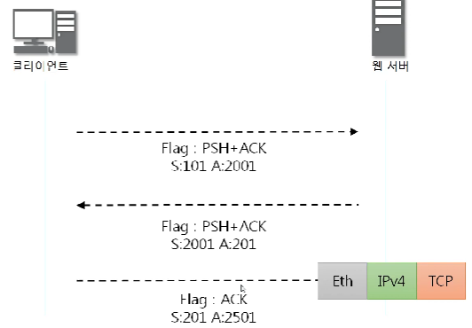
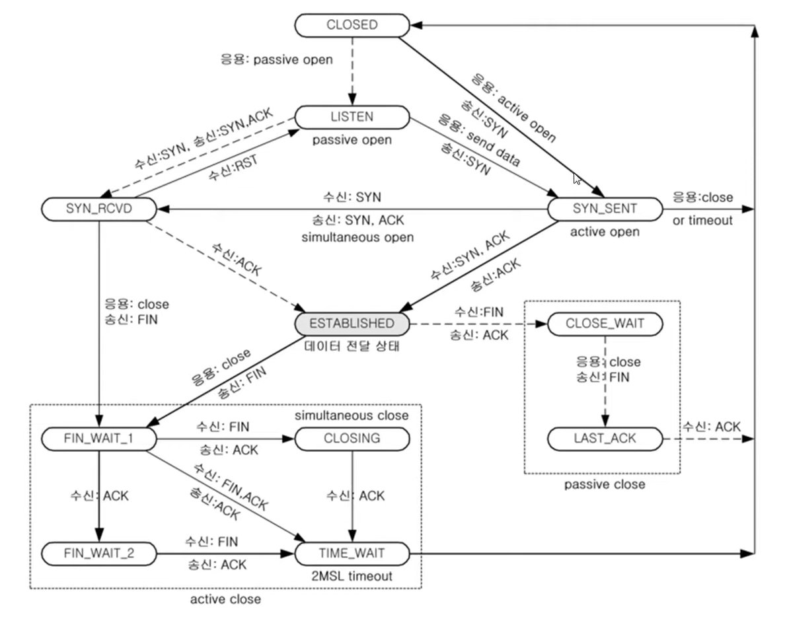
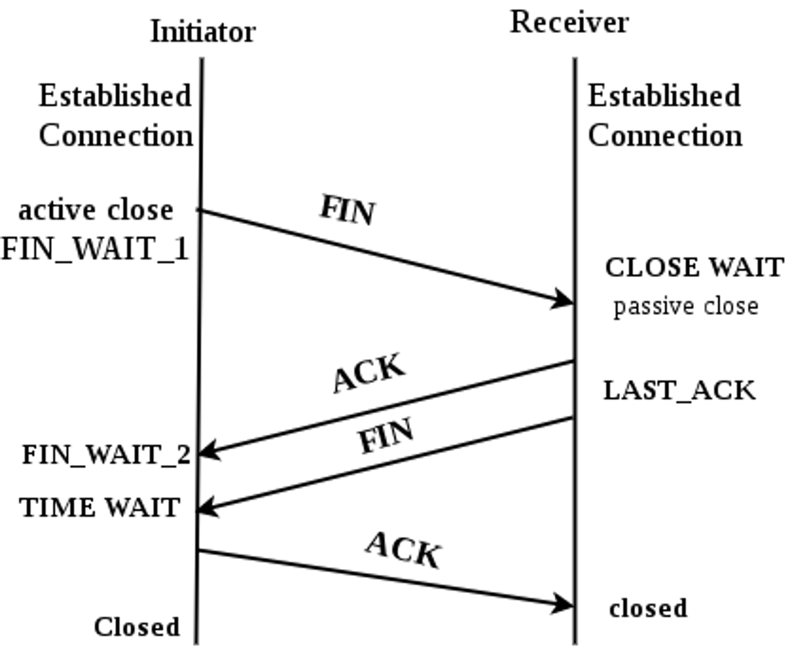

## UDP 프로토콜 ( User Datagram Protocol )

- `전송 방식이 너무 단순`해서 서비스의 `신뢰성이 낮음`
- 데이터그램 도착 순서가 바뀌거나, 중복되거나, 심지어는 통보 없이 누락시키기도 함
- 일반적으로 `오류의 검사와 수정이 필요 없는` 프로그램에서 수행할 것으로 가정
- 비연결형 서비스
- 신뢰성이 낮음

### 구조

### UDP 프로토콜을 사용하는 프로그램

- DNS 서버 - 도메인에 대한 IP를 알려줌
- tftp 서버 - 파일을 공유
- RIP 프로토콜 - 라우팅 정보를 공유

---

## TCP 프로토콜 ( Transmission Control Protocol )

- 인터넷에 연결된 컴퓨터에서 실행되는 프로그램 간에 통신을 `안정적으로, 순서대로, 에러없이` 교환 할 수 있게 함
- TCP의 안정성을 필요로 하지 않는 애플리케이션의 경우 일반적으로 TCP대신 UDP를 사용
- TCP는 UDP보다 `안전하지만 느림`
- `흐름제어`, `오류제어`, `혼잡제어` 수행

### 구조

- **Offset**
  - 헤더의 길이
  - 4로 나눠서 사용
- **Reserved**
  - 예약된 필드로 사용하지 않음
- **TCP Flags**
  - 연결 상태를 확인하는 역할
  - U - 긴급 데이터 설정 (우선순위가 높은 데이터가 포함)
  - A - 수신 확인 응답 설정 ( 물어본 것에 대한 응답, 승인 )
  - P - 송수신 버퍼에 있는 데이터를 즉시 처리
  - R - 연결 중단, 초기화
  - S - 동기화, 연결 설정 ( 상대방과의 연결을 시작할 때 )
  - F - 연결 종료
- **Window**
  - 수신측 여유 공간의 크기를 의미
  - 여유 공간이 없다면 보내지 않음
- **Checksum**
  - 헤더를 포함한 전체에 대해 오류를 검사
- **Urgent Pointer**
  - 긴급 데이터의 위치 값

### 통신과정

### 연결 수립 과정 (**3Way Handshake)**

TCP를 이용한 데이터 통신을 할 때 프로세스와 프로세스를 연결하기 위해 가장 먼저 수행되는 과정

1. 클라이언트가 서버에게 요청 패킷을 보냄
2. 서버가 클라이언트의 요청을 받아들이는 패킷을 보냄
3. 클라이언트는 이를 최종적으로 수락하는 패킷을 보냄

- 첫 SYN 은 랜덤 이후에는 ACK와 똑같이
- 뒤에 페이로드가 없기 때문에 ACK는 SYN + 1

### 데이터 송수신 과정

TCP를 이용한 데이터 통신을 할 때 단순 TCP 패킷만을 캡슐화 해서 통신하는 것이 아닌 페이로드를 포함한 패킷을 주고 받을 때의 일정한 규칙

1. 보낸 쪽에서는 SEQ번호와 ACK번호가 그대로
2. 받는 쪽에서 SEQ번호는 받은 ACK번호가 됨
3. 받는 쪽에서 ACK번호는 받은 SEQ번호 + 데이터 크기

### TCP 연결 상태의 변화

패킷을 주고 받으면서 변화하는 연결 상태

실선 - 클라이언트

점선 - 서버

**LISTEN** - 포트번호를 열어놓은 상태

**ESTABULISHED** - 연결이 수립된 상태, LISTEN 상태에서 ESTABULISHED상태가 돼야 서로 데이터를 주고 받을 수 있음

1. 서버는 항상 LISTEN 상태
2. 클라이언트에서 패킷을 보냄과 동시에 SYN_SENT 상태가 됨
3. 서버는 패킷을 받고 SYN_RECEIVED상태가 됨
4. 클라이언트는 서버의 패킷을 받고 ESTABULISHED 상태가 됨
5. 서버는 클라이언트의 응답을 받고 ESTABULISHED 상태가 됨

- 송신측은 수신측으로 부터 ACK를 받을 때 까지 기다리고 있는데 이로인해 속도 지연이 발생 (wait) ⇒ TCP가 느린 이유

- 수신측의 Window size가 MSS (Maximum Segment Size) 보다 크면 보냄
- 작으면 보내지 않고 wait ( 수신측에서 데이터를 받을 여유 공간이 없음을 의미)
- 송신측은 Window size가 여유로워 질 때 까지 기다리게 되고 이로 인해 속도지연 발생

- 여유가 생기기 위해서는 TCP Buffer에 있는 데이터들을 Socket File I/O Buffer 메모리에 올려야 함
- 이 속도가 네트워크에서 데이터를 수신하는 속도보다 느리면 Window size가 작아지고 wait이 걸리게됨

### 질문

## **4 way handshake - 연결 해제**

연결 성립 후, 모든 통신이 끝났다면 해제해야 한다.

1. 클라이언트는 서버에게 연결을 종료한다는 FIN 플래그를 보낸다.
2. 서버는 FIN을 받고, 확인했다는 ACK를 클라이언트에게 보낸다.

   (이때 모든 데이터를 보내기 위해 CLOSE_WAIT 상태가 된다)

3. 데이터를 모두 보냈다면, 연결이 종료되었다는 FIN 플래그를 클라이언트에게 보낸다.
4. 클라이언트는 FIN을 받고, 확인했다는 ACK를 서버에게 보낸다.

   (아직 서버로부터 받지 못한 데이터가 있을 수 있으므로 TIME_WAIT을 통해 기다린다.)

   - 서버는 ACK를 받은 이후 소켓을 닫는다 (Closed)
   - TIME_WAIT 시간이 끝나면 클라이언트도 닫는다 (Closed)
