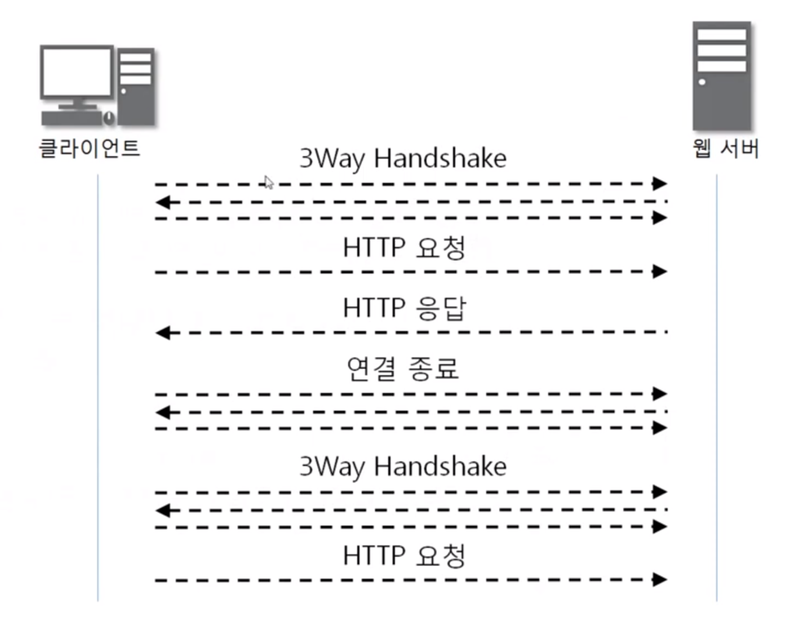
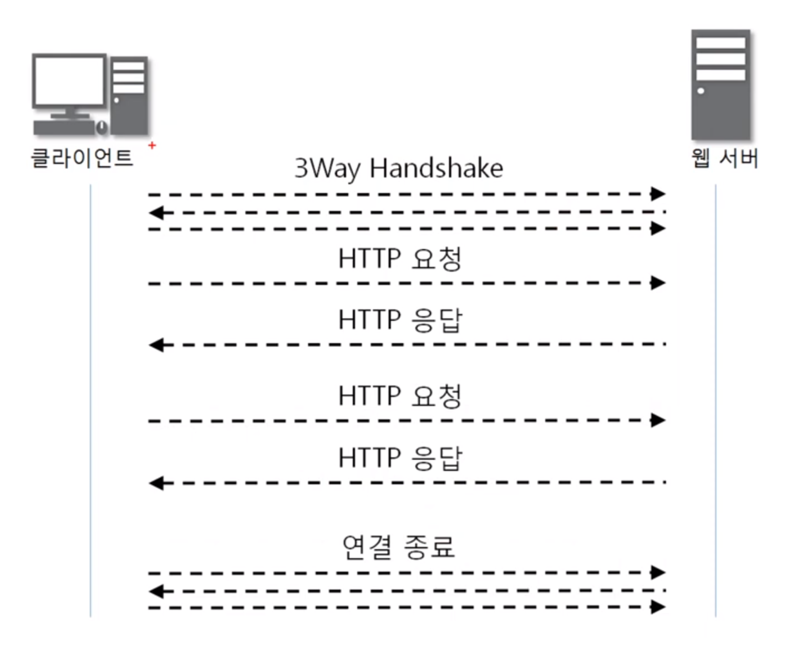
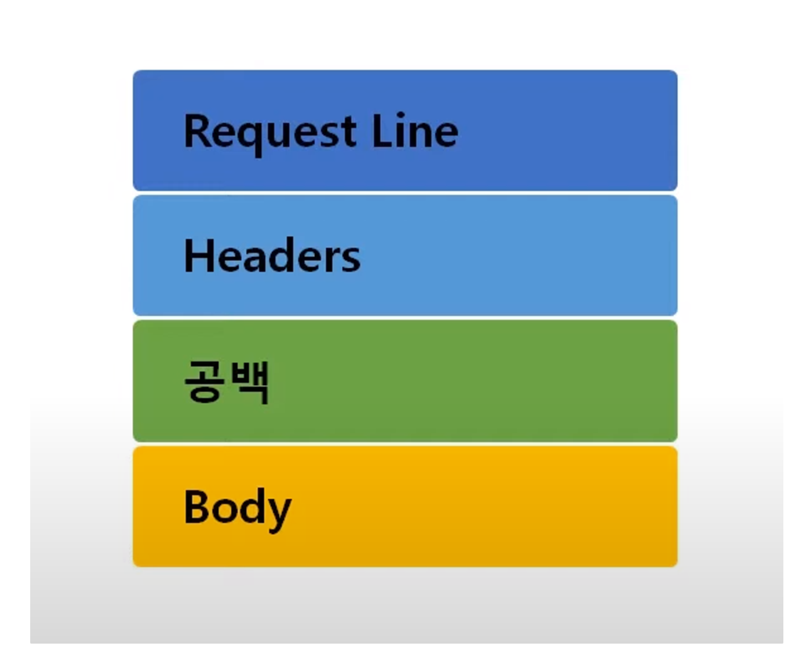
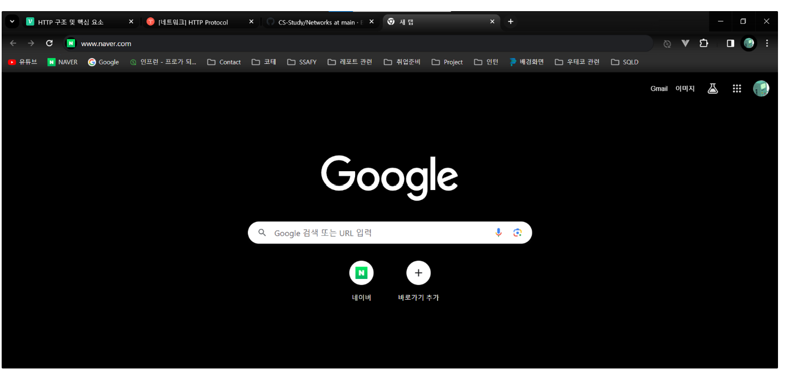
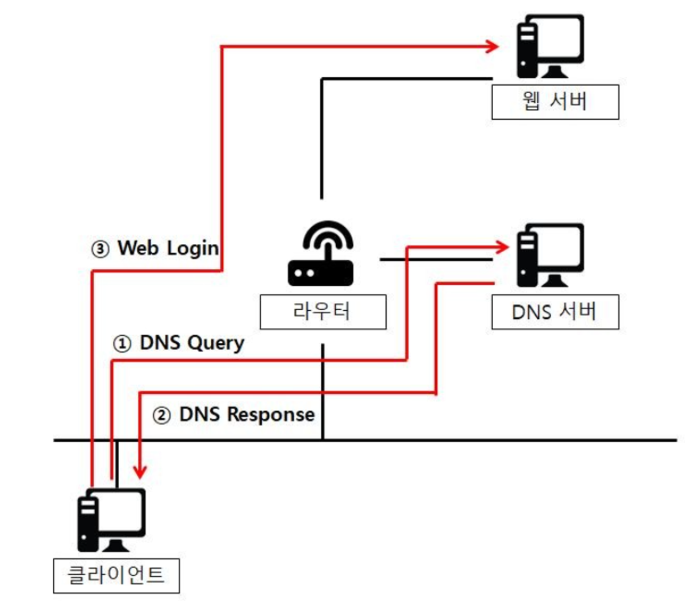
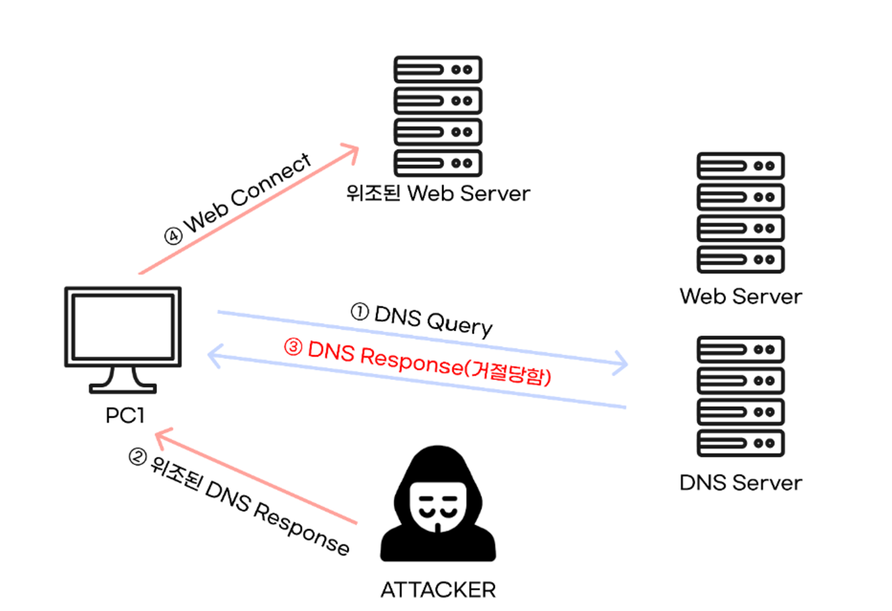
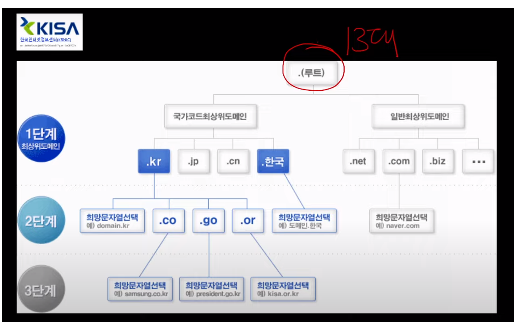
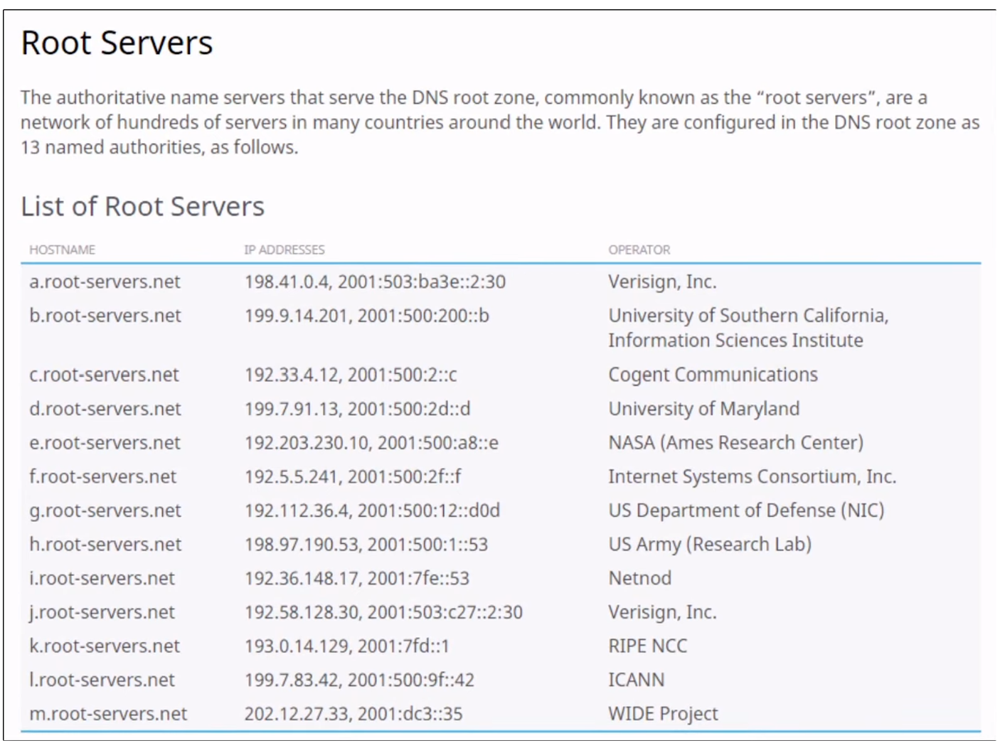
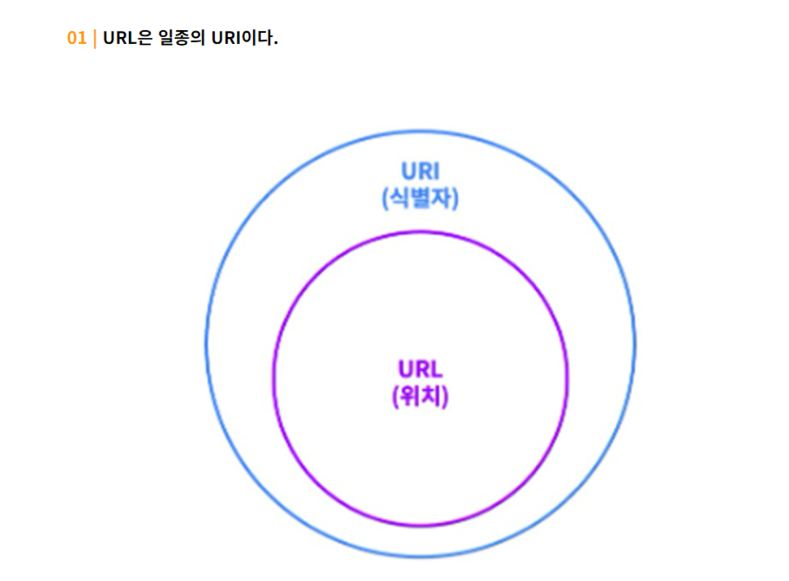

# 블로그 정리 링크

https://infinitecode.tistory.com/50 

https://infinitecode.tistory.com/51 

# HTTP 프로토콜

## 웹을 만들기 위해 사용되는 다양한 기술

- HTTP (HTTPS → SSL/TLS)
- HTML
- JavaScript
- CSS
- ASP/ASP.NET
- JSP
- PHP
- DB

## HTTP 프로토콜 특징

www에서 쓰이는 핵심 프로토콜로 문서의 전송을 위해 쓰이며, 오늘날 거의 모든 웹 어플리케이션에서 사용되고 있음.

>> 음성, 화상 등 여러 종류의 데이터를 MIME로 정의하여 전송 가능

**Request / Response (요청/응답)** 동작에 기반하여 서비스 제공

### 버전별 특징

**HTTP 1.0의 특징**

연결 수립, 동작, 연결 해제의 단순함이 특징 >> 하나의 URL은 하나의 TCP 연결

HTML 문서를 전송 받은 뒤 연결을 끊고 다시 연결하여 데이터를 전송.

**HTTP 1.0의 문제점**

단순 동작 ( 연결 수립, 동작, 연결 해제) 이 반복되어 통신 부하 문제 발생

위와 같은 문제를 해결하기 위해 HTTP 1.1이 등장

**HTTP 1.1의 특징**

HTTP 1.0과 호환 가능

**Multiple Request** 처리가 가능하여 Client의 Request가 많을 경우 연속적인 응답 제공 > Pipeline 방식의 Request / Response 진행

HTTP 1.0과는 달리 Server가 갖는 하나의 IP Address와 다수의 Web Site 연결 가능

HTTP 1.1

빠른 속도와 Internet Protocol 설계에 최적화될 수 있도록 Cache 사용

Data를 압축해서 전달이 가능하도록 하여 전달하는 Data 양이 감소

# HTTP 요청 프로토콜

## 구조

### Request Line

공백으로 각각의 데이터를 구별함.

요청 타입 : GET, POST, PUT, PATCH, DELETE 등등

### Header

해당 Request에 대한 추가 정보를 담고 있는 부분

자주 볼 수 있는 헤더 : Content-Type

해당 요청이 보내는 메세지 body의 타입. 예를 들어, JSON을 보내면 application/json.

### Body

해당 Request의 실제 메시지 및 내용.

Post의 경우 body부분에 데이터가 들어가고, Get의 경우 아예 없을 수 있음.

---

# 개발자 입장에서 Port번호 이해하기

## Port 번호

- Process 식별자!

TCP 소켓에 Attach되는 정보 중 하나.

Kernel 단에서는 NIC을 통해 들어온 패킷을 포트번호를 통해 식별하여 각 어플리케이션으로 전달.

## Port vs PID ?

포트번호는 프로세스에 대한 속성 정보가 아닌 프로세스가 활용하는 데이터에 대한 식별 정보에 불과함.

그에 반해 PID는 프로세스에 대한 속성 정보 및 다양한 정보를 알 수 있음.

# 웹 브라우저에 URL 입력하면 일어나는 일 - 인프라 위주

위와 같은 사진 속 상황 속 URL 입력을 하게 되었을 때 이후를 묻는 면접질문은 Well Known!

이에 대한 답변으로 신입 개발자의 입장에서는 아래와 같은 답변을 하게 된다면 기본적인 대답은 OK.

1. 주소창에 www.naver.com라는 특정 주소를 입력후 Enter 땅!
2. 위 URL에 대한 IP번호를 수신
    1. DNS Cache를 찾아보거나
    2. hosts File을 찾아봐서 해당 정보가 없다면 ISP의 DNS 서버에 질의를 보냄.

여기서 추가로 DNS서버에 질의를 보낼때도 분기가 나뉨.

1. 공유기를 사용하는 경우 : 공유기가 DNS 포워딩 기능을 수행.
2. 혹은 ISP Internet(KT같은 통신사 서비스가 될 수 있음)을 통한 DNS 질의를 직접적으로 수행.
1. 질의로 얻은 IP주소를 통해 해당 서버 쪽으로 TCP연결을 시도.
2. HTTP Request 요청
3. HTTP Response 응답

여기까지가 신입 개발자가 대답해야 할 수준

## 전체적인 흐름도

간혹 Google 및 Naver같은 대기업 지원의 경우에는 GSLB 또는 CDN 언급이 필수 아닌 필수가 됨.

<aside>
💡 nslookup : DNS 서버에 질의하여, 도메인의 정보를 조회하는 명령

nslookup을 통해 akamaiedge(CDN 서비스 제공회사) 같은 키워드를 보고 CDN을 사용하고 있구나 라는 정도의 이해까지 필요하며, CDN을 사용하는 이유를 또한 알 필요가 있음.

</aside>

**GSLB (Global Server Load Balancing)**

DNS서버에 의해 응답으로 오는 IP주소는 달라질 수 있음.

이는 네이버 같은 경우만 해도 전세계에 서버가 N대가 존재하기에 여러 IP를 가질 수 있고, 요청 측 IP주소와 거리가 가깝거나, 속도가 더 빠를 수 있는 IP를 주기위해 사용하는 개념.

Health Check를 통해 N개의 서버에 대한 상태를 기록할 수 있어서 사용할 수 있는 개념.

**CDN (Content Delivery Network)**

접속자의 IP와 위치 기반 가까운 곳에서 질의를 전송하므로써 전송 속도를 높이는 개념. (지연시간 감소)

정적 파일 복사본을 캐싱해놓고 있어서 바로바로 응답이 가능함.

사용자가 CDN 서버에 요청을 했는데 캐시에 없다면 원본 서버로부터 응답을 받아 사용자에게 IP 전송.

해당 응답을 유효기간과 함께 캐싱.

유효기간 만료 시 캐시에서 제거.

CDN 기술을 제공하는 대표적인 업체로는 Akamai, KT 등이 있음.

# Question.

네이버를 이용 중에 서울에 있는  네이버 서버에서 로그인을 했는데 서울 웹서버가 다운되었다면, 근처에 있는 부산 서버로 요청이 넘어갈텐데 로그인 세션 유지는 어떻게 할 것인가?

>> 백업서버 접근 시 IP주소를 직접 지정하는 경우라면 해당되지 않는 문제가 되겠습니다. 무엇보다 세션유지와 아무런 관련 없을 가능성이 높겠습니다. 그리고 세션은 L4에서도 존재합니다. 어느 수준 세션인가에 따라 답변은 매우 달라짐.

DNS Spoofing Attack 혹은 DNS 캐시 포이즈닝 공격에 대한 대처는 어떻게 할건가

>> 해당 공격은 DNS 서버에 있는 캐시에 유입되어 DNS가 유효하지 않은 결과 레코드를 반환하게 하는 공격입니다. (예를들어 네이버를 요청했는데 DNS 캐시에는 존재하지 않지만 공격에 의해 이상한 사이트의 IP를 응답으로 주게 되겠죠.) 

대처라고 한다면 hosts 파일을 사용할 경우 DNS Cache보다 우선적으로 참조되는 특성이 있기 때문에 hosts파일 갱신을 통해 적어도 hosts파일에 올라와있는 DN에 대해서는 해당 공격에 대해서 어느정도 대처를 할 수 있습니다.

DDoS에 대한 공격 대처는 어떻게 할건가

>> DDoS 공격을 간단하게 말하자면 서버에 대량으로 트래픽을 보내서 서버를 마비시켜 정상적인 트래픽이 못가게 하는 공격을 의미함.

AWS에서는 서버 좋은거 쓰라는데 이새기들 상술같긴 함 ㅋㅋ..

또다른 방법으로는 정상 및 비정상 트래픽을 파악할 수 있도록 개별 패킷 자체를 분석하여 합법적인 트래픽만 수용하는 방법입니다.

무중단 배포(Docker + 쿠버네티스) 환경에서의 장애대비가 가능할까?

>> 여기서 말하는 장애란 DNS System과 관련한 공격을 뜻하는 것 같은데, 모르겠음.

>> 예를 들어 도커와 nginx를 활용한 blue-green 무중단 배포 방식의 경우 

- 서버를 추가하거나 변경할 경우 설정파일을 수정하고 재시작하는 과정이 필요
- 프록시 대상 IP와 PORT가 항상 고정이여야 한다는 점
- 죽어 있는 포트가 살아 있는지 계속해서 체크하면서 생기는 Health Check (작지만 문제 있어보이는) 오버헤드

이런 문제를 해결하기 위해 Service Discovery라는 개념이 있습니다. 서버들의 정보(IP, Port등등)를 포함한 다양한 정보를 저장하고 가져오고 값의 변화가 일어날때 이벤트를 받아 자동으로 서비스의 설정 정보를 수정하고 재시작하는 개념입니다.

재해복구(DR)에 대한 추가정리 요망.

# 전세계 인터넷을 멈추는 방법과 DNS

Internet이란 Router와 DNS의 집합체

DNS는 분산형 데이터베이스 구조(계층적)를 가지고 있는데 이 중 Root DNS가 존재하며, 전세계의 13대가 존재하는데 이를 공격해서 마비시키면 됨.

즉 컴퓨터 13대를 보내버리면 됨…

## 추가적으로 DNS System에 대해 알아보자.

Domain Name은 단순 IP 숫자를 외우기 힘들어서 도입. (Feat. 전화번호부)

1. PC에서 도메인을 입력 시

DNS Cache를 찾아보거나 host File을 찾아봄.

사용하고 있는 ISP가 지원하는 DNS 및 DNS Chche가 있는데 한번 물어보았던 DNS에 대해서는 캐싱을 하여 더 이상 질의를 하지 않음.

DNS서버가 바로 IP를 응답해주지 않고 Root DNS에 .com을 다루는 DNS 리스트를 요청하여 전달 받음.

DNS서버는 리스트 중 위치가 가깝거나 어떤 기준에 의해 하나를 택하여 질의.

naver에 대해서 질의를 하여 응답을 받고, naver는 웹서버가 여럿 있기에 리스트를 응답으로 주게되면 www에 대해 질의 후 응답을 받은 IP를 종단점에 전달.

모든 응답에 대해서는 유효기간이 있고, 유효기간 안에 질의를 하면 캐싱을 하여 응답.

### Root DNS List

CMD에서 nslookup -199.9.14.201 같은 명령어를 입력하게 되면 해당 서버에 naver의 주소를 묻게되면 DNS서버 리스트를 보여줌. >> 약간 수직문화 리버스 느낌이라 위에서부터 아랫단 DNS서버로 물어봐야하는 시스템

중요하게 생각해야 할 부분

악성코드 감염같은 상황이 생길 경우 DNS캐시가 훼손되거나 호스트 파일이 훼손됨. >> 네이버로 요청을 하게되면 이상한 주소를 받을 수 있음.

# URL vs URI ?

두 개의 키워드는 같은 느낌, 같은 역할 같지만 URI가 URL의 상위라는 점만 기억.
