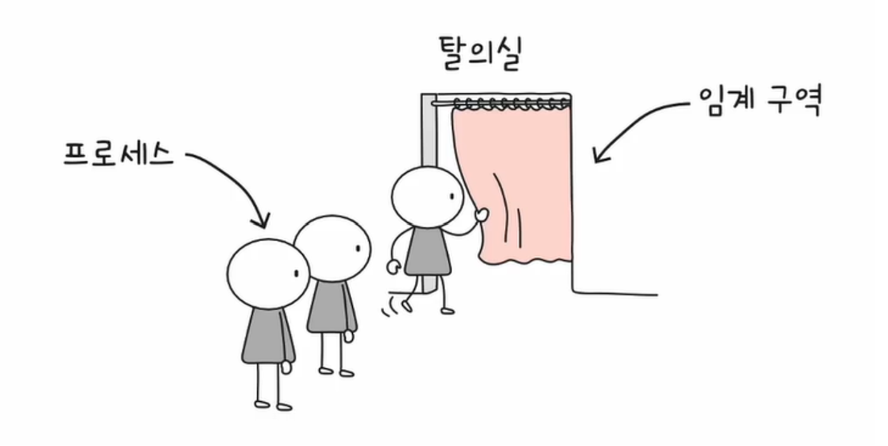
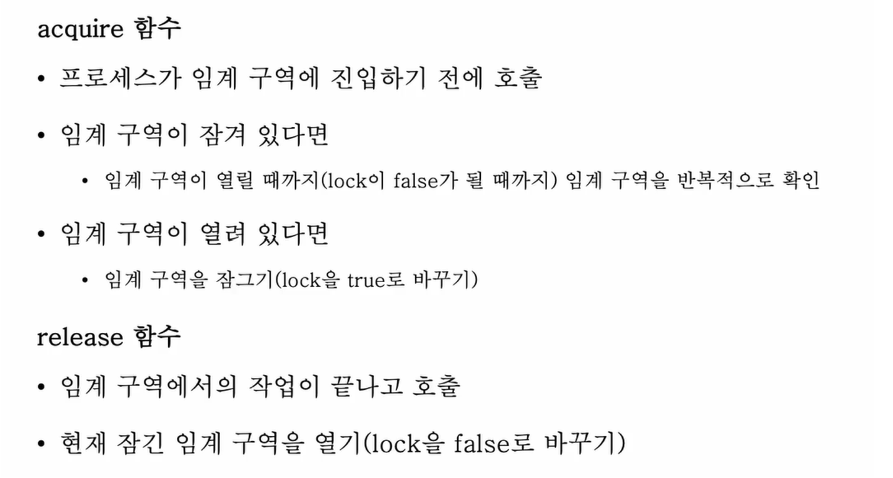
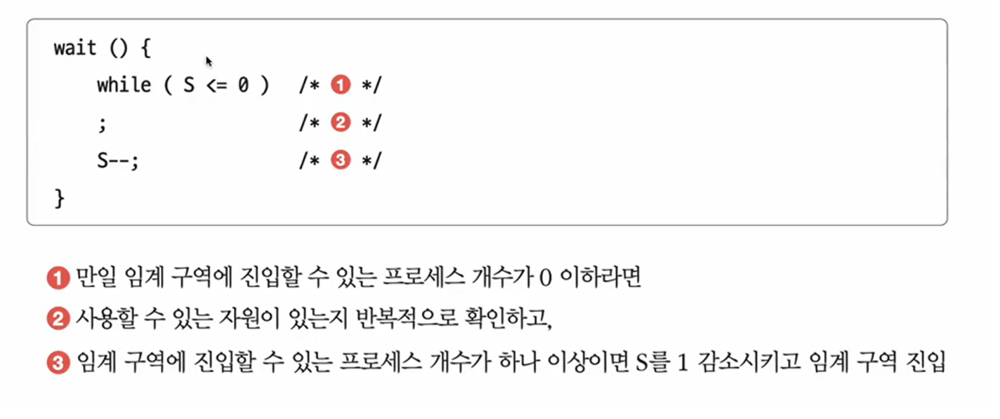
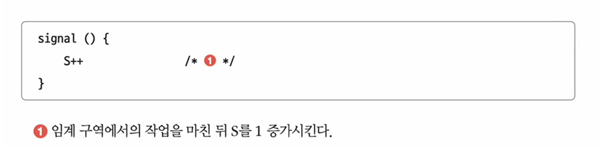
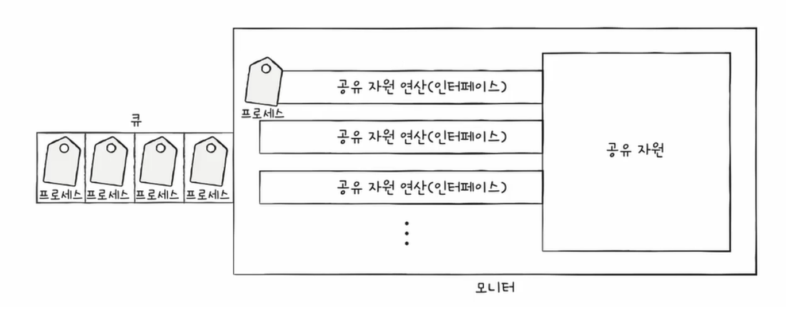
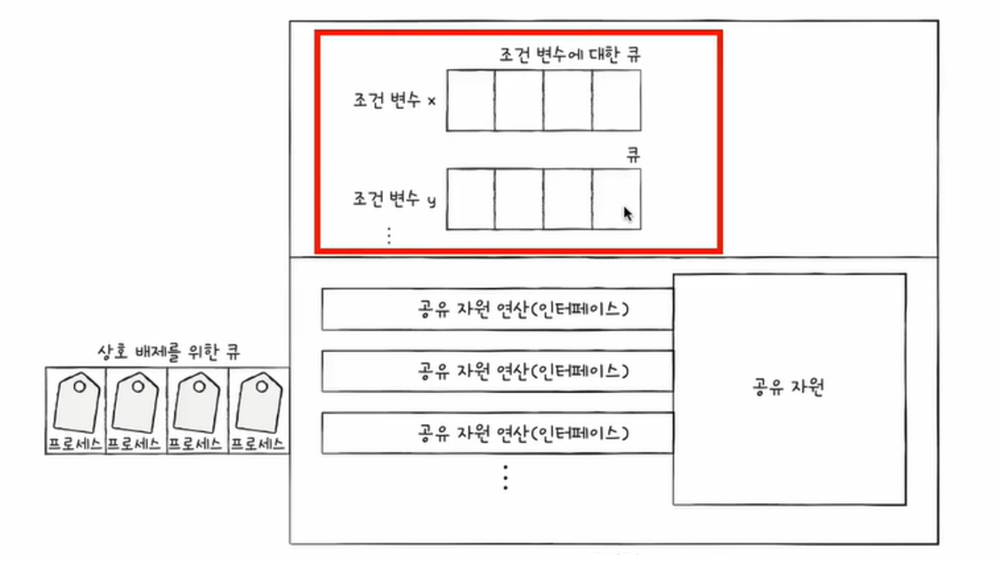

# 블로그 정리 링크

https://infinitecode.tistory.com/56

# 1. 프로세스 동기화

<aside>
💡 **동시다발적으로 실행되는 프로세스와 쓰레드들은 서로 협력하면서 영향을 주고받게 되는데 이 과정에서 자원의 일관성을 보장해야 함.**

</aside>

## 프로세스 동기화란 ?

- **실행순서 제어** : 프로세스를 올바른 순서대로 실행하기
    - 글 쓰는 프로세스가 먼저 실행된 후 읽는 프로세스가 실행되어야 정상적으로 데이터가 넘어가기 때문.
- **상호 배제** : **동시에 접근해서는 안 되는 자원**에 하나의 프로세스만 접근하게 하기
    - Bank account problem
    - 프린터처럼 한 번에 하나의 프로세스만 접근해야 하는 자원

- Producer & Consumer Problem

## 공유 자원과 임계 구역

### 공유 자원

- 여러 프로세스 혹은 스레드가 공유하는 자원
    - 전역 변수, 파일, 입출력장치, 보조기억장치 등

### 임계 구역

- 동시에 실행하면 문제가 발생하는 자원에 접근하는 코드 영역

**임계 구역에 동시에 접근하면 자원의 일관성이 깨질 수 있다.**

⇒ 이를 레이스 컨디션(race condition)이라 한다.

### Solution.

- 임계 구역에 진입하고자 하면 진입한 프로세스 이외에는 대기해야 한다.
- 운영체제가 임계구역 문제를 해결하는 세 가지 원칙
    - 상호 배제를 위한 동기화를 위한 세 가지 원칙
        1. 상호 배제
            1. 한 프로세스가 임계 구역에 진입했다면 다른 프로세스는 들어올 수 없다.
        2. 진행
            1. 임계 구역에 어떤 프로세스도 진입하지 않았다면 진입하고자 하는 프로세스는 들어갈 수 있어야 한다.
        3. 유한 대기
            1. 한 프로세스가 임계 구역에 진입하고 싶다면 언젠가는 임계 구역에 들어올 수 있어야 한다. (임계 구역에 들어오기 위해 무한정 대기해서는 안 된다.)

# 2. 동기화 기법 및 도구

**대중적인 세 가지 기법**

1. 뮤텍스 락
2. 세마포어
3. 모니터

## 뮤텍스 락(Mutex Lock)

- 상호 배제를 위한 동기화 도구(탈의실의 자물쇠 역할)

<aside>
💡 **뮤텍스 락의 단순한 형태**
전역 변수 하나, 함수 두 개

- 자물쇠 역할 : 프로세스들이 공유하는 전역 변수 lock
- 임계 구역을 잠그는 역할 : **acquire** 함수
- 임계 구역의 잠금을 해제하는 역할 : **release** 함수

</aside>

- busy waiting : 무한히 반복하면서 임계 구역이 잠겨있는지 확인하는 행동.

## 세마포어(Semaphore)

- 좀 더 일반화된 방식의 동기화 도구
- 공유 자원이 여러 개 있는 경우에도 적용 가능
- 이진 세마포어, 카운팅 세마포어 중 카운팅 세마포어에 대해서만.

- 임계 구역 앞에서 멈춤 신호를 받으면 잠시 기다리기

- 임계 구역 앞에서 가도 좋다는 신호를 받으면 임계 구역 진입

<aside>
💡 세마포어의 단순한 형태
전역 변수 하나, 함수 두 개

- 임계 구역에 진입할 수 있는 프로세스의 개수(사용 가능한 공유 자원의 개수)를 나타내는 전역 변수 S
- 임계구역에 들어가도 좋은지, 기다려야 할지를 알려주는 **wait함수**
- 임계구역 앞에서 기다리는 프로세스에 ‘이제 가도 좋다’고 신호를 주는 **signal함수**

</aside>

### wait함수

### signal함수

- 세마포어 또한 S가 0일 시 Busy Waiting이 발생하여 CPU낭비가 발생할 수 있음.
    - 사용할 수 있는 자원이 없을 경우(S == 0) **대기 상태**로 만듦
        - 해당 프로세스의 PCB를 대기 큐에 삽입
    - 사용할 수 있는 자원이 생겼을 경우 대기 큐의 프로세스를 **준비 상태**로 만듦
        - 해당 프로세스의 PCB를 대기 큐에서 꺼내 준비 큐에 삽

<aside>
💡 세마포어를 활용한 **실행 순서 동기화**

- 세마포어의 변수 S를 0으로 두고,
- 먼저 실행할 프로세스 **뒤에 signal** 함수,
- 다음에 실행할 프로세스 **앞에 wait** 함수를 붙이면 됨.

</aside>

### 단점

- 매번 임계구역 앞뒤로 wait(), signal()을 호출하다가 실수라도 한다면 굉장히 큰 문제를 발생할 수 있음.
- 사용자 입장에서 사용하기 번거로움

## 모니터

- 세마포어의 단점을 위해 등장한 기법
- 사용자(개발자)가 다루기 편한 동기화 도구

1. 상호 배제를 위한 동기화
    - 인터페이스를 위한 큐
    - 공유자원에 접근하고자 하는 프로세스를 (인터페이스를 위한) 큐에 삽입
    - 큐에 삽입된 순서대로 (한 번에 하나의 프로세스만) 공유 자원 이용

1. 실행 순서 제어를 위한 동기화
    - 조건 변수 이용
    - 프로세스나 스레드의 실행 순서를 제어하기 위해 사용하는 특별한 변수
    - 조건변수.wait() : 대기 상태로 변경, 조건 변수에 대한 큐에 삽입
    - 조건변수.signal() : wait()으로 대기 상태로 접어든 조건변수를 실행 상태로 변

<aside>
💡 모니터 안에는 하나의 프로세스만이 있을 수 있다

- wait()를 호출했던 프로세스는 signal()을 호출한 프로세스가 모니터를 떠난 뒤에 수행을 재개
- signal()을 호출한 프로세스의 실행을 일시 중단하고 자신이 실행한 뒤 다시 signal()을 호출한 프로세스의 수행을 재개
</aside>

<aside>
💡 핵심!
상호 배제를 위한 동기화뿐만 아니라 실행 순서 제어를 위 동기화까지 제공하는데
1. 특정 프로세스가 아직 실행될 조건이 되지 않았을 때에는 wait를 통해 실행을 중단
2. 특정 프로세스가 실행될 조건이 충족되었을 때에는 signal을 통해 실행을 재개

</aside>
